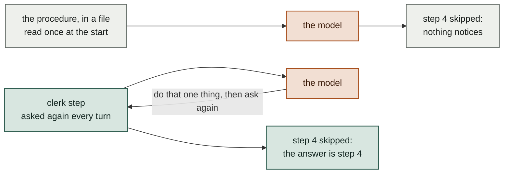
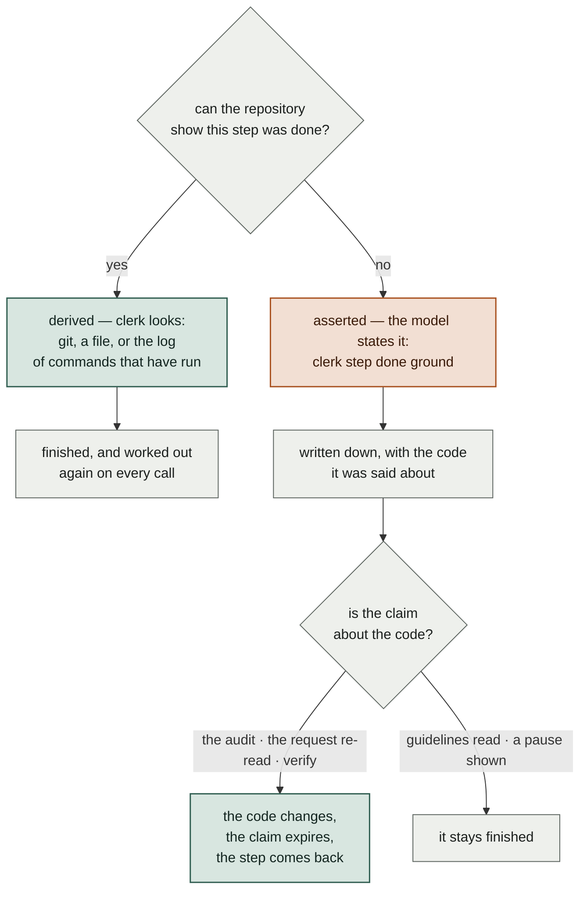
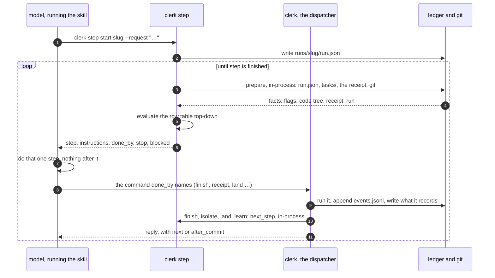
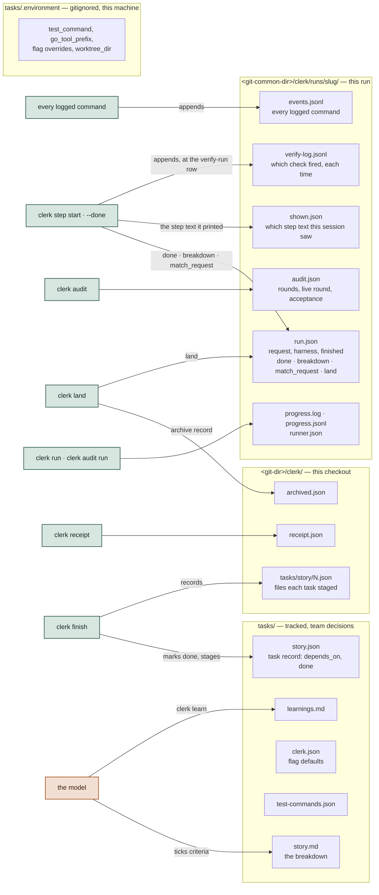
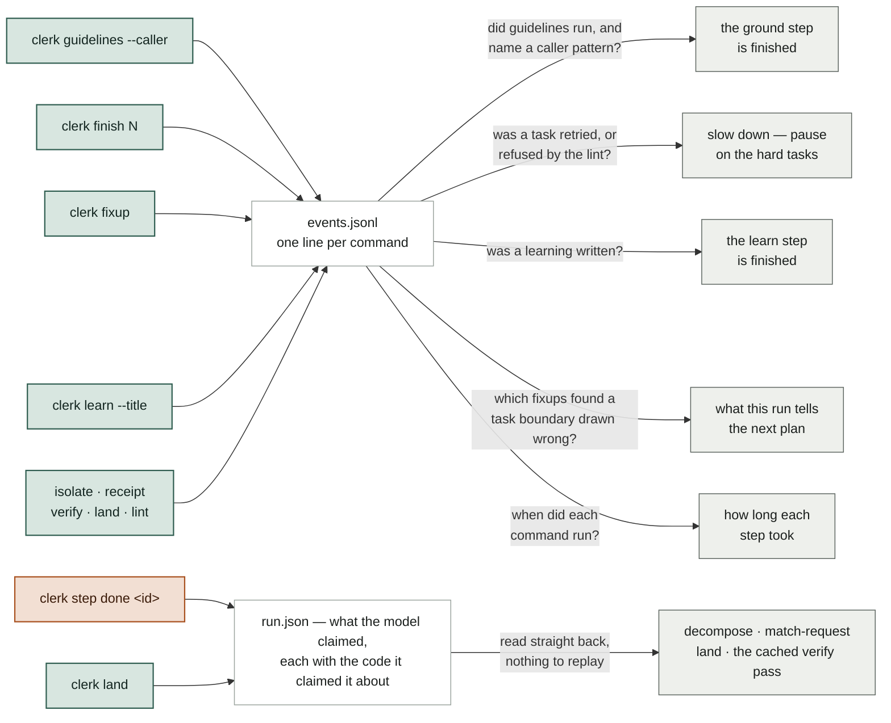
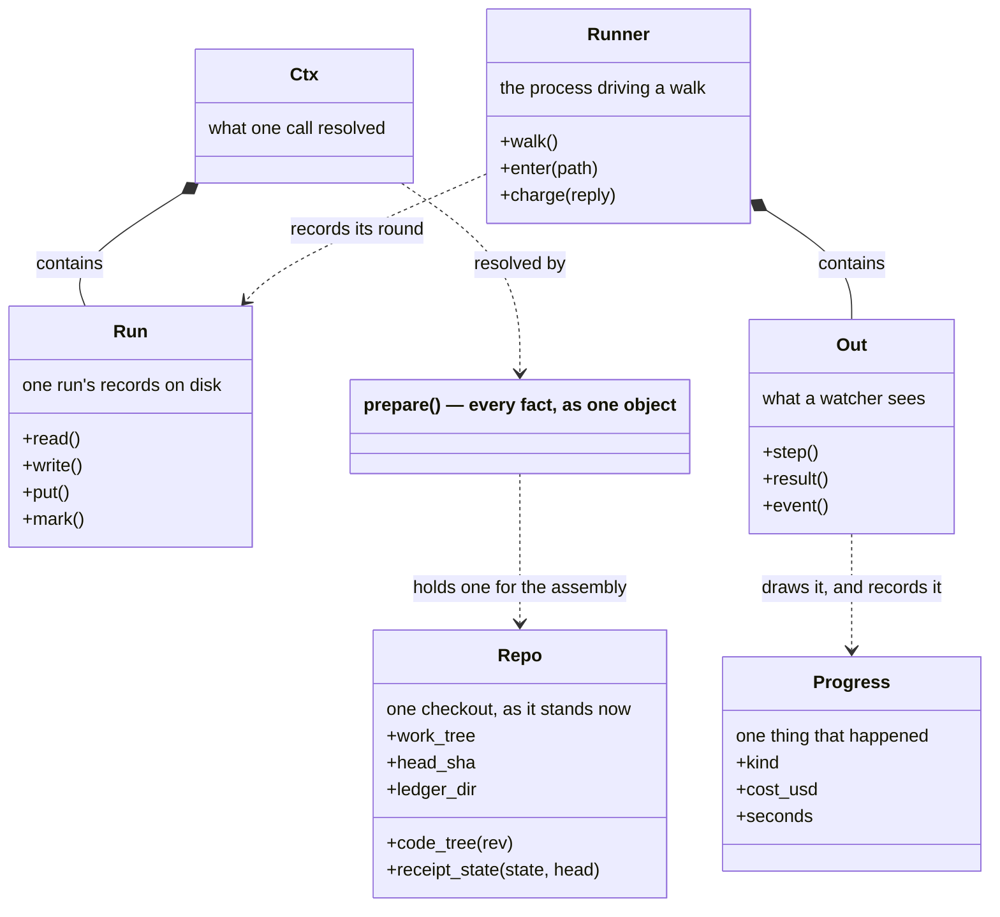
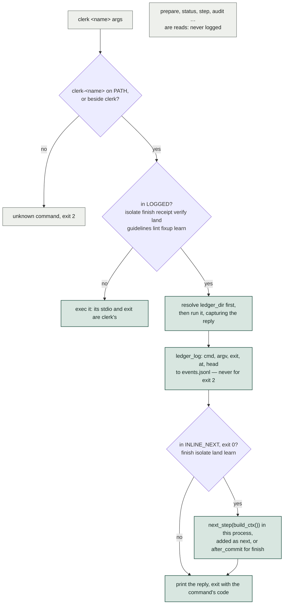
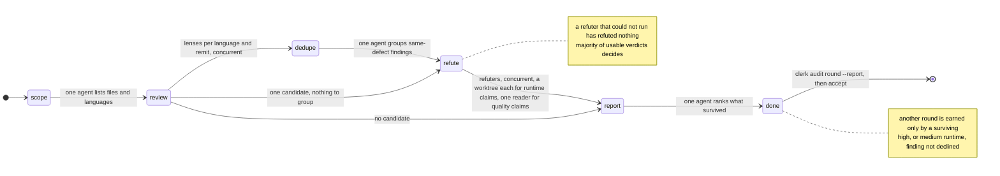
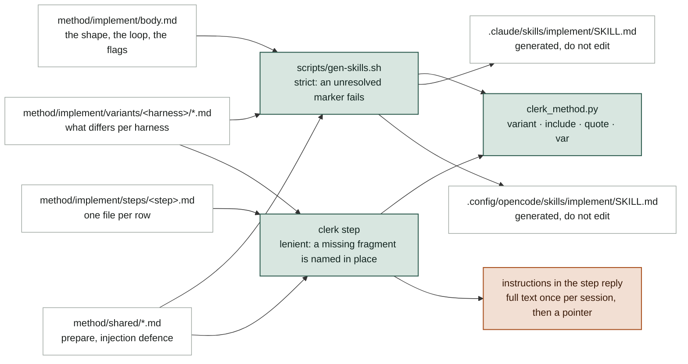

# Inside clerk

This page shows how the implement skill and clerk fit together. It is for someone who is about to change them. Green marks what clerk decides from evidence. Terracotta marks what the model judges. The method README uses the same two fills.

The whole design is one split. A clerk command does anything a program does more reliably than a prompt. That covers which test command wins and which task is next. It also covers whether a green receipt describes the tree that is about to land, and what step comes next. The model still writes the code, reviews it, and decides that a fix is right.

## The problem, and the one idea

The obvious way to make a model follow a procedure is to write the procedure down and give it to the model. This half works. A model follows only part of a long list, and a skipped step is silent. Nothing later in the run knows that step 4 never happened. The run continues, and the gap appears at review or after it.

clerk stores the position nowhere. There is no counter and no checklist. Every turn asks the same question. clerk works the answer out again from the repository each time:

Everything else on this page follows from that. There are eleven steps in a fixed order. The code that answers "is this step done?" is that step's **row**. The whole pass over one request is a **run**. The records clerk keeps for a run are its **ledger**.

## Two ways a step can be finished

clerk checks a step against the repository whenever it can. Some steps are not visible there. Nothing in git shows that someone read the guidelines and thought about them. Nothing in git shows that someone re-read the request against the branch and found a match.

For those steps there are two options: trust the model in silence, or ask the model to state the claim. clerk asks for the claim and records it. When the claim is about the code, clerk records it *against* that code. A change to the code then withdraws the claim.

The two fills mark this split on every diagram below. Green is where clerk decides. Terracotta is where the model decides. This is also why an assertion is never a bare flag: nothing can withdraw a claim that carries no code.

The same rule shapes the rest. `clerk finish` asks which files a task owns and does not read `git status`. Git does not show what someone meant to change.

The plan lives in two files. A person writes the **breakdown**, `tasks/<story>.md`. clerk keeps the per-task state in the **task record**, `tasks/<story>.json`. clerk therefore never edits prose it did not write. A **receipt** records that the suite passed and what it passed against. Without that second part, "the tests pass" describes a moment and not the branch.

## One call, repeated

Here is that loop in full, with the parts that are not obvious. `clerk step` gathers the repository's facts inside its own process. It does not run other commands to get them. The model's next move is a different command, the one the reply names in `done_by`. Four of those commands return the step that follows, so one call both closes a step and asks for the next.

A stopped run needs nothing to start it again. The next call is the call the run makes anyway.

**Where it lives:** link/common/dot-local/bin/clerk-step (main_step, cmd_step) · clerk_ledger.py (build_ctx) · clerk_steps.py (evaluate, present) · method/implement/body.md, section "The loop"

**When to change it:** To add a field to every reply, change `present` in clerk_steps.py. To change what a fresh call resolves first, change `build_ctx`.

## The step table and what closes each row

The eleven steps, in order. `clerk step` reads them from the top and returns the first step that is not done.

Some claims carry the *code tree* they describe. The code tree is the file listing at HEAD, minus the breakdown files under `tasks/`, hashed. clerk compares by the code tree and not by the commit. A run can therefore commit its own breakdown, such as the archive or the write-up, and keep a green suite. Any change to the code still makes that suite stale.

Two labels on the diagram need more detail. *Gears* is an optional flag. With gears on, a task that the breakdown marks as low certainty or high blast radius stops once its tests are red. A person then sees those tests before anyone writes code. *`not_checked`* holds what `clerk verify` ran but cannot judge. Two examples are a symbol that only prose mentions, and a task that owns no file of its own. clerk leaves those for a person and does not count them as clean.

**Where it lives:** clerk_steps.py: ROWS and the row_* functions · clerk-step: the DONE handlers · method/clerk-step.md, section "The step table"

**When to change it:** A new row needs four things:

- a `row_<name>` function that returns `row(id, done, …)`
- a place in ROWS
- a step file under method/implement/steps/
- a section in tests/clerk-step-test.sh

## Four places state lives, and who writes each

There are four places and not one, because each has a different owner and a different lifetime. The team's decisions need review, so git tracks them and they go into the commits. One machine's preferences concern nobody else, so they sit in a gitignored file.

What clerk records is neither of those. A tracked ledger dirties the tree on every write, and the step table reads a clean tree as its signal that a task is committed. A tracked ledger also puts session records in front of reviewers, where the model can edit them.

So the ledger lives under `.git`. What one checkout knows sits in that checkout's git dir. What the run knows sits in the common git dir, because a run's last steps happen in the main checkout after the worktree is gone.

**Where it lives:** clerk_repo.py: Repo.state_dir, Repo.ledger_dir, run_records_dir, ledger_log · clerk_ledger.py: Run · method/clerk-step.md, section "Ledger"

**When to change it:** Put a new per-run fact in the ledger through `Run.put` or `Run.mark`. Never put it in tasks/. A tracked ledger dirties the tree on every write and puts session evidence into pull requests.

## The log, and the record

A derived step must answer a question like this one: has `clerk guidelines` run for this run, and did it name a caller pattern? Git holds no answer. The cheapest answer is to write one line each time one of clerk's own commands ends. Every question of that kind then becomes a search of that list.

The dispatcher appends one line for each of the nine commands that change something. The line holds the command, its arguments, its exit code, the time, and HEAD. clerk does not log reads. `clerk step` alone runs several times for each step, and its lines hide everything else.

clerk keeps a log, and not one flag for each question, because new questions arrive later. Nobody planned for the question "how many fixups found a task boundary drawn across one file?". The lines were already there, and the answer came from a new read of the same file. The right side of the diagram can therefore grow while the left side stays the same.

A log is slow to read at a glance. The question "where is this run?" needs one look, not a replay. So clerk writes what the model claims into `run.json`. It reads that record straight back. Each side pays for the other. The log answers questions nobody asked yet. The record answers the question asked now.

Two steps accept either source. The ground step finishes when a `clerk guidelines --caller` run appears in the log. In a repository with no guidelines to read, it finishes when the model says so. The learn step at the end works the same way. The reply names the source, so nobody must guess whether clerk saw the evidence or was told.

`verify-log.jsonl` is a second log. It answers a question the first log cannot. The event log records that `clerk verify` ran and its exit code, but not which checks reported a problem. The question "is this step worth what it blocks?" needs those checks. Nothing in clerk reads this log. It is there for a person who compares many runs.

The audit keeps its own file because it needs both halves at once. Its list of finished rounds only grows. clerk rewrites a round still in progress each time a review agent returns. Several threads do this at the same time. If each of those writes also rewrote the run's identity, two threads can lose one another's updates.

**Where it lives:** clerk: LOGGED · clerk_repo.py: ledger_log · clerk_ledger.py: events, guidelines_read, task_signals, gear, learn_written, fixup_ambiguities · method/clerk-step.md, section "The event log"

**When to change it:** Derive a fact that a clerk command already produces. Do not assert it. Add a reader beside `guidelines_read` instead of a `step done` handler. Assert only what no command can see. A new command in `LOGGED` costs one set entry. Removal of a command from `LOGGED` silently breaks every reader that folds it.

## Files, and which imports which

There is one dispatcher, one executable for each command, and a set of modules beside them. A command that needs what another one knows imports it and does not run it. The repository's facts, the task record, the checks, the land logic, and the step table are all modules. Each import goes by path, so it works whether the tree is stowed or not.

That leaves git, the harness, and a few places where one command runs another as a program on purpose. `finish` runs `clerk-lint`, and the dispatcher runs the executables. Nothing calls back up the stack. A failure is therefore one stack trace, and not a reply parsed out of another command's stdout.

**Where it lives:** link/common/dot-local/bin/ · clerk_lib.py for what every command does the same way

**When to change it:** A new command is a new clerk-<name> executable. Its first docstring line must read `clerk <name> — …`, and the dispatcher then lists it with no other change. Put the logic in a clerk_*.py module. Keep the executable to its arguments, so another command can import the logic and does not have to run it.

## The types, and what each one owns

Most of clerk is functions, and it must stay that way. A rule that reads a file and answers a question holds nothing between calls. A type earns its place only where something must be kept: a directory of records, one checkout's answers, a walk in progress. Six types carry a run between commands, and each owns one thing. The rest are local to one file: a markup renderer, the audit's prompt builder, and an argument parser.

**`Repo`** (clerk_repo) is one checkout and the git facts about it. It asks git each question at most once. To ask once, something must keep the answer, and a plain function over a cwd has nowhere to keep it. The facts also share their git questions. The common dir sits behind the repo root, the runs directory, and the ledger alike. Separate functions therefore ask git the same thing several times in one call. The plain functions stay as the interface, and each one holds a `Repo` for the length of its own work.

**`Run`** (clerk_ledger) is the directory under `<git-common-dir>/clerk/runs/<slug>/` and the reads and writes over it. Every per-run fact goes in through `put` or `mark`.

**`Ctx`** (clerk_ledger) is what one call resolved: the facts from `prepare`, and the run this tree belongs to. `clerk step` passes it to the rows, so each row gets its answers and does not fetch them.

**`Runner`** is the process that drives a walk. There are two. The one in `clerk-run` walks a story's step table. The one in `clerk-audit` walks a round's phases. They share a word on purpose, because they do the same job. Each writes its own record as it goes, so a run that starts again knows what finished before.

**`Out`** and **`Progress`** (clerk_render) are the two halves of how clerk shows a run. `Progress` is one thing that happened, and it holds its numbers as numbers. `Out` draws the line and writes the record. Three readers need this: the person who watches, the status line, and `clerk watch`. Only the first needs the line.

**Two rules a change here has to keep:**

**A `Repo` answers for the checkout as it stood when someone made it.** Hold one across a stretch of code that only reads. Take a new one after anything that moves a ref: a commit, a switch, or a rebase.

`clerk_land` is the worked example. `land_checks` holds one, because it reads and writes nothing. `land` takes one for each phase, and a fresh one on each side of its rebase. That check exists only to see whether HEAD differs across the rebase. One instance answers the second read from the first, and the check then always passes. The other option is a `Repo.moved()` call after each change. That puts the rule back in the caller's memory, where a missed call is silent.

**Progress travels as a record and not as a line.** A later reader needs a cost, a duration, and the name of the agent. Each of those is a field on `Progress`. Never match one back out of the drawn text. clerk rounds that text to the cent, so a turn that costs less than one cent adds nothing to the total. An error message that holds a `$` also reads as a cost.

**Where it lives:** clerk_repo.py: Repo · clerk_ledger.py: Run, Ctx · clerk-run, clerk-audit: Runner · clerk_render.py: Out, Progress

**When to change it:** Add a new fact about the checkout as a `Repo` member. Do not add a plain function that runs git, because `Repo` must be the only thing here that asks git about the repository. Add a new `Progress` kind for anything a walk must report. `clerk watch` then reads it and needs no new prefix.

## A command's round trip through the dispatcher

`clerk` itself does almost nothing. It finds `clerk-<name>` and hands control to it, the way git finds `git-<name>`. A new command is therefore a new executable, and nothing needs to be told that it exists.

Two things make the dispatcher more than a lookup. A command that counts as evidence must leave a trace. For those, the dispatcher runs the command as a child and writes the log line after the command ends. Four commands close a step. For those, the dispatcher works out the next step in its own process and adds it to the reply. For every other command the dispatcher replaces itself with the command, which costs nothing.

The dispatcher resolves the ledger before the command runs, not after. `land --integrate` ends on a branch that no longer names the run. The dispatcher never logs a usage error, which is exit 2 in every command, because a mistyped call is not evidence of anything.

**Where it lives:** link/common/dot-local/bin/clerk: LOGGED, INLINE_NEXT, run_logged

**When to change it:** Put a command into LOGGED when its run must count as evidence for a row. The row then reads it through an event reader in clerk_ledger.py, such as `guidelines_read`.

## The audit is a second machine of the same shape

The audit reviews the finished branch with agents and not with rules. A *lens* is one agent. It covers one angle over one language, and the angles are semantic, guidelines, concurrency, performance, and tests. A *refuter* gets a single finding and must disprove it. Only a finding that survives that argument reaches the report.

`clerk audit next` hands out one phase's jobs with every prompt resolved. `clerk audit record` takes the replies and advances the phase. `clerk audit run` walks that loop and starts a headless harness only where it needs a judgment. It writes each reply to the live round as the reply arrives. A round that someone killed then starts again with only the jobs that remain.

The walk runs in a process that no command owns. `clerk audit run` forks it twice, so its parent is init, and then only copies what it prints. A guard that stops the command therefore stops the wait and not the round. Claude Code's low-memory guard is one such guard. `clerk audit wait` waits for the round again and ends on its summary. `clerk audit stop` ends the round.

**Where it lives:** clerk-audit: audit_next, audit_record, audit_run, Runner, audit_launch, relay, audit_wait, audit_stop · clerk_audit_panel.py: LANG, remit_for, build_panel, refute_jobs · clerk_harness.py: run_job, run_batch · method/audit-implement/prompts/ and schemas.json

**When to change it:** Change what a lens gets, or how many refuters a claim gets, in clerk_audit_panel.py. That change reaches both harnesses at once. Change how clerk starts an agent in `_argv` and `_envelope` in clerk_harness.py, and nowhere else.

## Where the words the model reads come from

clerk generates everything the model reads from sources under `method/`. The *harness* is the tool that runs the model, either Claude Code or opencode. The harness loads a skill file at the start, and that file holds only what is true before any step runs. Each step's method is its own file, and clerk renders it when the run reaches that step.

Both paths use one resolver. A *variant* is a piece of prose that differs by harness. clerk keeps a variant apart so the shared text stays one copy. One resolver means a variant renders the same way in the skill and in the reply.

**Where it lives:** scripts/gen-skills.sh · clerk_method.py · clerk_steps.py: instructions_for, instructions_text · Taskfile: `task common:gen` and `gen:skills:check`

**When to change it:** Edit the source under method/. Never edit a SKILL.md. Then run `task common:gen`. A step's text changes with no generator run. A change to body.md or to a variant needs the generator, and `--check` fails the build until the generator runs.

## Contributing a change

- **Run the suites.** `env -u CLAUDECODE tests/clerk-test.sh`, `tests/clerk-step-test.sh`, and `tests/clerk-run-test.sh`. They build throwaway repositories and assert on JSON. The step suite takes a few minutes. Inside a Claude Code session you must unset the variable, or six worktree cases fail for a reason that is not yours.
- **Regenerate the prose.** Run `task common:gen` after you change anything under method/ that a SKILL.md is built from. `task common:gen:skills:check` tells you whether you need to.
- **Mind the links.** ~/.local/bin/clerk-* are stow symlinks into this working tree. Every other session on the machine runs your saved edit next, so keep each edit and test cycle short.
- **Keep the split.** A change that makes the model remember an order, or derive a fact again, belongs in a command or a row. A change that asks a program to judge whether code is right belongs with the model.
