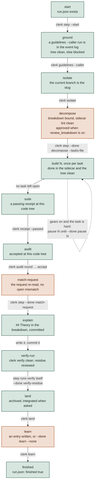
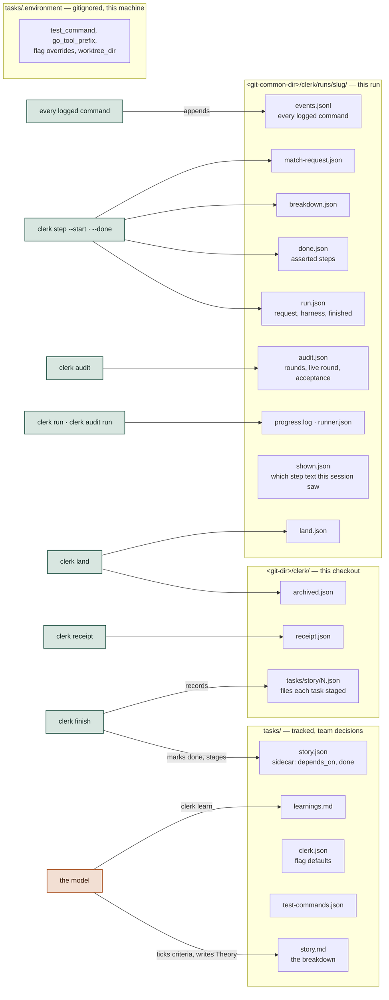
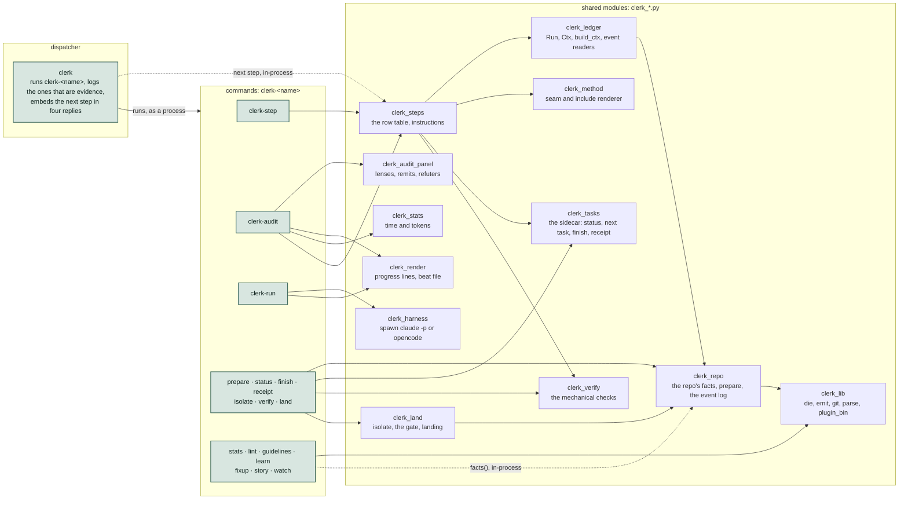
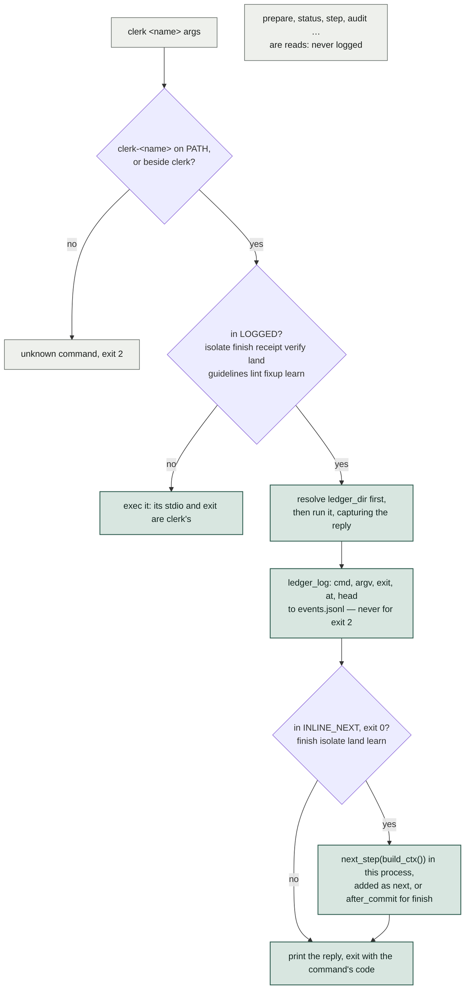
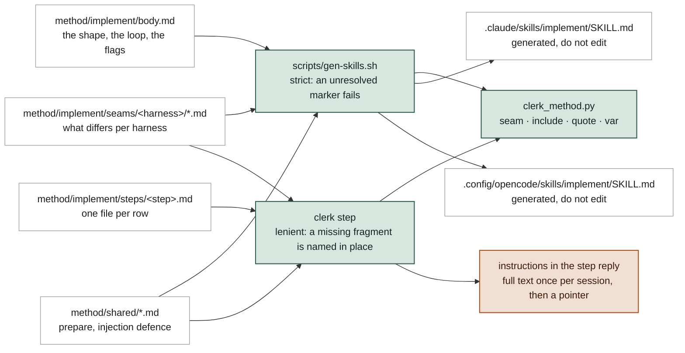

# Inside clerk

Seven diagrams of how the implement skill and clerk fit together, drawn for someone about to change them. Green is what clerk decides from evidence; terracotta is what the model judges. The same two fills mean the same two things in the method README.

The whole design is one split. Anything a program does more reliably than a prompt — which test command wins, which task is next, whether a green receipt describes the tree about to land, what step comes after this one — is a clerk command. Writing the code, reviewing it and deciding a fix is right stay with the model.

So the implement skill is one loop: ask `clerk step` what comes next, do that one thing, ask again. clerk answers from git state and a ledger it keeps per run, and the prose for each step arrives in the reply rather than in the skill file.

## One call, repeated

The skill never walks a procedure from memory. Every turn is the same call, and the answer is recomputed from the repository and the ledger, so a stopped run resumes with the call it would have made anyway. Commands that close a step embed the next one in their reply so the model does not spend a round trip asking.

```mermaid
sequenceDiagram
  autonumber
  participant M as model, running the skill
  participant S as clerk step
  participant C as clerk, the dispatcher
  participant L as ledger and git
  M->>S: clerk step --start slug --request "…"
  S->>L: write runs/slug/run.json
  loop until step is finished
    S->>L: prepare, in-process: run.json, tasks/, the receipt, git
    L-->>S: facts: flags, code tree, receipt, run
    S->>S: evaluate the row table top-down
    S-->>M: step, instructions, done_by, stop, blocked
    M->>M: do that one step, nothing after it
    M->>C: the command done_by names (finish, receipt, land …)
    C->>L: run it; append events.jsonl, write its stamp
    C->>S: finish, isolate, land, learn: next_step, in-process
    C-->>M: reply, with next or after_commit
  end
```

**Where it lives:** link/common/dot-local/bin/clerk-step (main_step, cmd_step) · clerk_ledger.py (build_ctx) · clerk_steps.py (evaluate, present) · method/implement/body.md, section "The loop"

**When you would change it:** Adding a field to every reply: `present` in clerk_steps.py. Changing what a fresh call resolves first: `build_ctx`.

## The step table and what closes each row

`clerk step` reads the rows from the top and returns the first one that is not done. A green row closes when clerk observes the world change; a terracotta row closes when the model records a judgment with `--done`, stamped with the code tree it applies to. Nothing moves the position but evidence.



**Where it lives:** clerk_steps.py: ROWS and the row_* functions · clerk-step: the DONE handlers · method/clerk-step.md, section "The step table"

**When you would change it:** A new row is one `row_<name>` function returning `row(id, done, …)` plus its place in ROWS, a step file under method/implement/steps/, and a section in tests/clerk-step-test.sh.

## Four places state lives, and who writes each

Tracked files under tasks/ are team decisions and go into commits. The environment file is one machine's. The two directories under .git are clerk's own records: per checkout for what one worktree knows, per run in the common git dir so the ledger outlives the worktree that is removed at the end.



**Where it lives:** clerk_repo.py: state_dir, ledger_dir, run_records_dir, ledger_log · clerk_ledger.py: Run · method/clerk-step.md, section "Ledger"

**When you would change it:** A new per-run fact goes in the ledger through `Run.write` or `Run.mark`, never in tasks/: a tracked ledger would dirty the tree on every write and put session evidence into PRs.

## Files, and which imports which

One Python dispatcher runs `clerk-<name>` executables, the way git runs `git-<name>`. Every call between commands is an import: the repo's facts, the sidecar, the checks, the landing and the step table are modules beside the executables, imported by path so they work stowed or not. The only subprocesses left are git, the harness, and a command another command deliberately runs as a program — `clerk-lint` from finish, the executables from the dispatcher — so nothing calls back up the stack.



**Where it lives:** link/common/dot-local/bin/ · clerk_lib.py for what every command does the same way

**When you would change it:** A new command is a new clerk-<name> executable with a first docstring line reading `clerk <name> — …`; the dispatcher lists it without being told. Put the logic in a clerk_*.py module and keep the executable to argument parsing, so another command can import it rather than run it.

## A command's round trip through the dispatcher

Commands whose running is evidence are run rather than exec'd, so their exit is appended to the run's event log on the way out, and four of them get the next step computed in the dispatcher's own process and added to their reply. The ledger is resolved before the command runs, because `land --integrate` ends on a branch the run is no longer named by. A usage error, exit 2 everywhere, is not evidence and is not logged.



**Where it lives:** link/common/dot-local/bin/clerk: LOGGED, INLINE_NEXT, run_logged

**When you would change it:** A command whose running should count as evidence for a row goes into LOGGED, and the row reads it through an event reader in clerk_ledger.py such as `guidelines_read`.

## The audit is a second machine of the same shape

`clerk audit next` hands out one phase's batch of agent jobs with every prompt resolved; `record` takes the replies and advances. `clerk audit run` walks that loop in-process and spawns a headless harness only where a judgment is wanted. Each landed reply is written to the live round as it arrives, so a killed round resumes with only the rest.


**Where it lives:** clerk-audit: audit_next, audit_record, audit_run, Runner · clerk_audit_panel.py: LANG, remit_for, build_panel, refute_jobs · clerk_harness.py: run_job, run_batch · method/audit-implement/prompts/ and schemas.json

**When you would change it:** What a lens is owed, or how many refuters a claim gets, changes in clerk_audit_panel.py and reaches both harnesses at once. How an agent is spawned changes only in clerk_harness.py's `_argv` and `_envelope`.

## Where the words the model reads come from

The skill file the harness loads is generated, and holds only what is true before any step runs. Each step's method is its own file, rendered for the harness at the moment the step is reached. Both readings go through one resolver, so a seam that renders in the skill renders the same way in the reply.



**Where it lives:** scripts/gen-skills.sh · clerk_method.py · clerk_steps.py: instructions_for, instructions_text · Taskfile: `task common:gen` and `gen:skills:check`

**When you would change it:** Edit the source under method/, never the SKILL.md, then run `task common:gen`. A step's text changes without regenerating anything; a change to body.md or a seam needs the generator, and `--check` fails the build until it has run.

## Contributing a change

- **Run the suites.** `env -u CLAUDECODE tests/clerk-test.sh`, `tests/clerk-step-test.sh` and `tests/clerk-run-test.sh`. They build throwaway repositories and assert on JSON; the step suite takes a few minutes. Inside a Claude Code session the variable has to be unset or six worktree cases fail for no reason of yours.
- **Regenerate the prose.** `task common:gen` after touching anything under method/ that a SKILL.md is built from; `task common:gen:skills:check` is what tells you whether you needed to.
- **Mind the links.** ~/.local/bin/clerk-* are stow symlinks into this working tree. A saved edit is what every other session on the machine runs next, so keep an edit-and-test cycle short.
- **Keep the split.** If a change makes the model remember an order or re-derive a fact, it belongs in a command or a row instead. If it asks a program to judge whether code is right, it belongs with the model.
