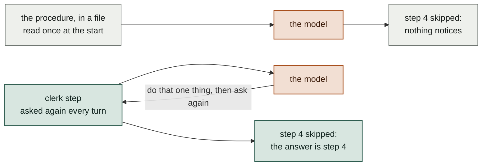
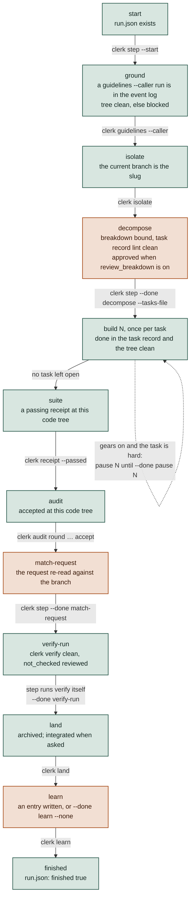
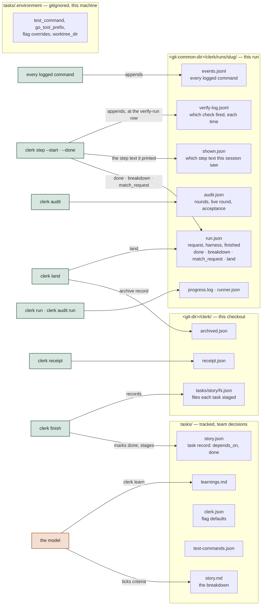
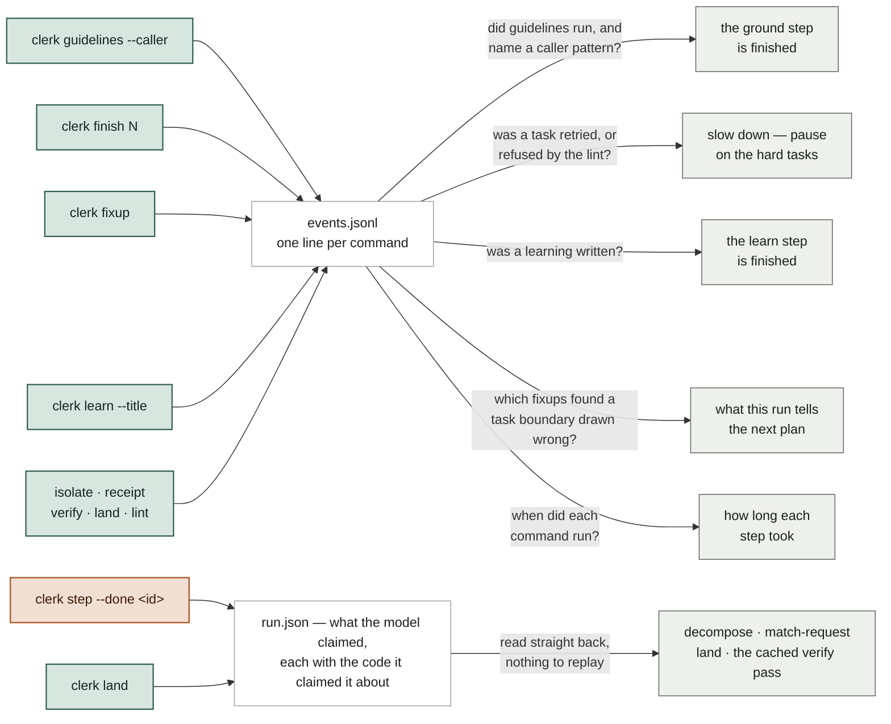
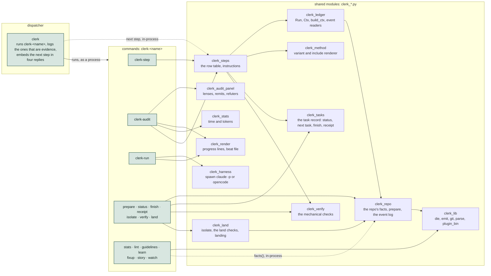
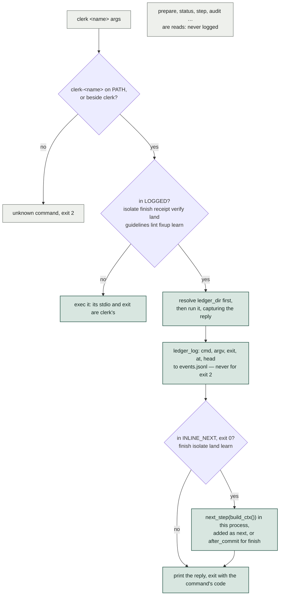
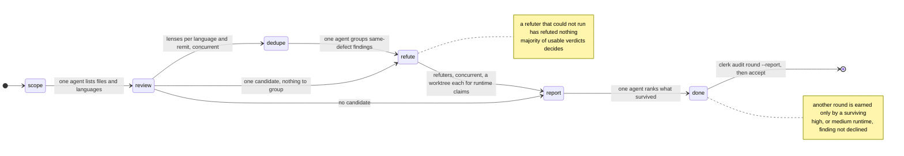
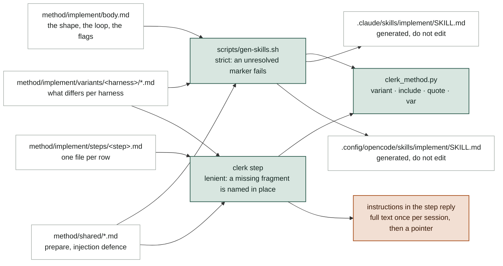

# Inside clerk

How the implement skill and clerk fit together, drawn for someone about to change them. Green marks what clerk decides from evidence, terracotta what the model judges — the same two fills as in the method README.

The whole design is one split. Anything a program does more reliably than a prompt — which test command wins, which task is next, whether a green receipt describes the tree about to land, what step comes after this one — is a clerk command. Writing the code, reviewing it and deciding a fix is right stay with the model.

## The problem, and the one idea

The obvious way to make a model follow a procedure is to write the procedure down and hand it over. It half works. A long enough list gets partly followed, and a skipped step is silent — nothing downstream knows step 4 never happened, so the run keeps going and the gap shows up at review, or later.

clerk's answer is to stop storing the position anywhere. There is no counter and no checklist. Every turn asks the same question, and the answer is worked out fresh from the repository:

Everything else on this page follows from that. There are eleven steps in a fixed order; the code that answers "is this one done?" for a step is its **row**; the whole pass over one request is a **run**, and the records clerk keeps for it are its **ledger**.

## Two ways a step can be finished

If clerk could check every step by looking at the repository, it would, and there would be nothing to explain. But some steps are not observable. Nothing in git can show that the guidelines were read and thought about, or that the request was re-read against the branch and found to match.

The choice there is between trusting the model silently and making it say so out loud. clerk does the second: the claim is recorded, and — when the claim is about the code — recorded *against* that code, so changing the code takes the claim back.

That is the split the two fills mark on every diagram below: green where clerk decides, terracotta where the model does. It is also why an assertion is never a bare flag — a claim with no code attached could never be taken back.

The same instinct runs through the rest. `clerk finish` asks which files a task owns rather than reading `git status`, because "what I meant to change" is not observable either. The plan lives in two files — a **breakdown**, `tasks/<story>.md`, written by a person, and a **task record**, `tasks/<story>.json`, where clerk keeps per-task state — so clerk never edits prose it did not write. A **receipt** records that the suite passed *and* what it passed against, because "the tests pass" without that is a claim about a moment, not about the branch.

## One call, repeated

That loop in full, with the parts of it that are not obvious. `clerk step` gathers the repository's facts in its own process rather than shelling out for them. The model's next move is a different command entirely — whatever the reply's `done_by` named. And four of those commands hand back the step that follows, so closing one and asking for the next is a single call rather than two.

A stopped run needs nothing to restart it: the next call is the call it would have made anyway.

**Where it lives:** link/common/dot-local/bin/clerk-step (main_step, cmd_step) · clerk_ledger.py (build_ctx) · clerk_steps.py (evaluate, present) · method/implement/body.md, section "The loop"

**When you would change it:** Adding a field to every reply: `present` in clerk_steps.py. Changing what a fresh call resolves first: `build_ctx`.

## The step table and what closes each row

The eleven, in order. `clerk step` reads them from the top and returns the first one not done.

Where a claim is stamped with the *code tree* it was made about, that means the file listing at HEAD minus the breakdown files under `tasks/`, hashed. Comparing by that rather than by commit is what lets the run commit its own breakdown — the archive, the write-up — without making a green suite stale, while any touch of the code still does.

Two labels on it are worth spelling out. *Gears* is an optional flag: with it on, a task the breakdown called low certainty or high blast radius stops once its tests are red, so a person sees them before any code is written. *`not_checked`* is what `clerk verify` ran but could not judge — a symbol only prose mentions, a task owning no file of its own — left for a person rather than counted as clean.

**Where it lives:** clerk_steps.py: ROWS and the row_* functions · clerk-step: the DONE handlers · method/clerk-step.md, section "The step table"

**When you would change it:** A new row is one `row_<name>` function returning `row(id, done, …)` plus its place in ROWS, a step file under method/implement/steps/, and a section in tests/clerk-step-test.sh.

## Four places state lives, and who writes each

Four rather than one, because they have different owners and different lifetimes. What the team decides is meant to be reviewed, so it is tracked and goes into the commits. What one machine prefers is nobody else's business, so it sits in a gitignored file.

What clerk records is neither. Tracking it would dirty the tree on every write — the exact signal the step table reads to know a task has been committed — and would put session records in front of reviewers, where the model could edit them. So it lives under `.git`: what one checkout knows in that checkout's git dir, what the run knows in the common one, because a run's last steps happen in the main checkout after the worktree is gone.

**Where it lives:** clerk_repo.py: state_dir, ledger_dir, run_records_dir, ledger_log · clerk_ledger.py: Run · method/clerk-step.md, section "Ledger"

**When you would change it:** A new per-run fact goes in the ledger through `Run.put` or `Run.mark`, never in tasks/: a tracked ledger would dirty the tree on every write and put session evidence into PRs.

## The log, and the record

A derived step has to answer something like "has `clerk guidelines` run for this run, naming a caller pattern?" Nothing in git knows. The cheapest answer is to write a line down every time one of clerk's own commands finishes, and let any such question become a search of that list.

So the dispatcher appends one line — the command, its arguments, its exit code, the time, and HEAD — for each of the nine commands that change something. Reads are not logged: `clerk step` alone runs several times per step and would bury everything else.

A log rather than a flag per question, because the questions arrive later. Nothing decided in advance that a run would want to know how many fixups found a task boundary drawn across one file — the lines were already there, and answering it meant reading the same file a new way. That is why the right side of the picture can grow without the left side changing.

What a log is bad at is being glanced at. "Where is this run?" should be one look rather than a replay, so what the model claims goes into `run.json` and is read straight back. Each side pays for the other: the log answers questions nobody has asked yet, the record answers the one being asked now.

Two steps take either. Ground finishes when a `clerk guidelines --caller` run turns up in the log, or — in a repo with no guidelines to read — when the model says so. The learning at the end is the same. The reply names which one answered, so nobody has to guess whether clerk saw it or was told.

`verify-log.jsonl` is a second log, for a question the first cannot answer. The event log records that `clerk verify` ran and what it exited, not which of its checks fired, and "is this step worth what it blocks?" needs the checks. Nothing in clerk reads it; it is there for a person looking across many runs.

The audit keeps a file of its own because it wants both halves at once. Its list of finished rounds only ever grows, but a round still in flight is rewritten as each review agent lands, from several threads at a time — and putting a rewrite of the run's identity behind every one of those writes is a lost update waiting to happen.

**Where it lives:** clerk: LOGGED · clerk_repo.py: ledger_log · clerk_ledger.py: events, guidelines_read, task_signals, gear, learn_written, fixup_ambiguities · method/clerk-step.md, section "The event log"

**When you would change it:** A fact a clerk command already produces should be derived, not asserted — add a reader beside `guidelines_read` rather than a `--done` handler. Assert only what no command can see. Adding a command to `LOGGED` costs one set entry; taking one out silently strands every reader that folds it.

## Files, and which imports which

One dispatcher, an executable per command, and a set of modules beside them. Where a command needs what another one knows, it imports it rather than running it: the repo's facts, the task record, the checks, the landing and the step table are all modules, imported by path so they work whether the tree is stowed or not.

That leaves git, the harness, and the few places a command deliberately runs another as a program — `clerk-lint` from `finish`, the executables from the dispatcher. Nothing calls back up the stack, so a failure is one stack trace rather than a reply parsed back out of another command's stdout.

**Where it lives:** link/common/dot-local/bin/ · clerk_lib.py for what every command does the same way

**When you would change it:** A new command is a new clerk-<name> executable with a first docstring line reading `clerk <name> — …`; the dispatcher lists it without being told. Put the logic in a clerk_*.py module and keep the executable to argument parsing, so another command can import it rather than run it.

## A command's round trip through the dispatcher

`clerk` itself does almost nothing. It finds `clerk-<name>` and hands over, the way git finds `git-<name>`, so a new command is a new executable and nothing has to be told it exists.

Two things make it more than a lookup. A command whose running is evidence has to leave a trace, so rather than becoming that command the dispatcher runs it and writes the line on the way out. And four commands close a step, so it works the next one out in its own process and adds it to the reply. Everything else it simply becomes, which costs nothing.

The ledger is resolved before the command runs rather than after, because `land --integrate` finishes on a branch the run is no longer named by. A usage error — exit 2 in every command — is never logged: a mistyped invocation is not evidence of anything.

**Where it lives:** link/common/dot-local/bin/clerk: LOGGED, INLINE_NEXT, run_logged

**When you would change it:** A command whose running should count as evidence for a row goes into LOGGED, and the row reads it through an event reader in clerk_ledger.py such as `guidelines_read`.

## The audit is a second machine of the same shape

The audit reviews the finished branch with agents rather than rules. A *lens* is one of them: one angle — semantic, guidelines, concurrency, performance, tests — over one language. A *refuter* is given a single finding and asked to disprove it, so what reaches the report is what survived being argued with. `clerk audit next` hands out one phase's batch of those jobs with every prompt resolved; `record` takes the replies and advances. `clerk audit run` walks that loop in-process and spawns a headless harness only where a judgment is wanted. Each landed reply is written to the live round as it arrives, so a killed round resumes with only the rest.

**Where it lives:** clerk-audit: audit_next, audit_record, audit_run, Runner · clerk_audit_panel.py: LANG, remit_for, build_panel, refute_jobs · clerk_harness.py: run_job, run_batch · method/audit-implement/prompts/ and schemas.json

**When you would change it:** What a lens is owed, or how many refuters a claim gets, changes in clerk_audit_panel.py and reaches both harnesses at once. How an agent is spawned changes only in clerk_harness.py's `_argv` and `_envelope`.

## Where the words the model reads come from

Everything the model reads is generated from sources under `method/`. The skill file the *harness* — the tool running the model, Claude Code or opencode — loads at the start holds only what is true before any step runs. Each step's method is its own file, rendered at the moment the step is reached. Both readings go through one resolver, so a *variant* — a piece of prose that differs by harness, kept apart so the shared text stays one copy — renders the same way in the skill and in the reply.

**Where it lives:** scripts/gen-skills.sh · clerk_method.py · clerk_steps.py: instructions_for, instructions_text · Taskfile: `task common:gen` and `gen:skills:check`

**When you would change it:** Edit the source under method/, never the SKILL.md, then run `task common:gen`. A step's text changes without regenerating anything; a change to body.md or a variant needs the generator, and `--check` fails the build until it has run.

## Contributing a change

- **Run the suites.** `env -u CLAUDECODE tests/clerk-test.sh`, `tests/clerk-step-test.sh` and `tests/clerk-run-test.sh`. They build throwaway repositories and assert on JSON; the step suite takes a few minutes. Inside a Claude Code session the variable has to be unset or six worktree cases fail for no reason of yours.
- **Regenerate the prose.** `task common:gen` after touching anything under method/ that a SKILL.md is built from; `task common:gen:skills:check` is what tells you whether you needed to.
- **Mind the links.** ~/.local/bin/clerk-* are stow symlinks into this working tree. A saved edit is what every other session on the machine runs next, so keep an edit-and-test cycle short.
- **Keep the split.** If a change makes the model remember an order or re-derive a fact, it belongs in a command or a row instead. If it asks a program to judge whether code is right, it belongs with the model.
