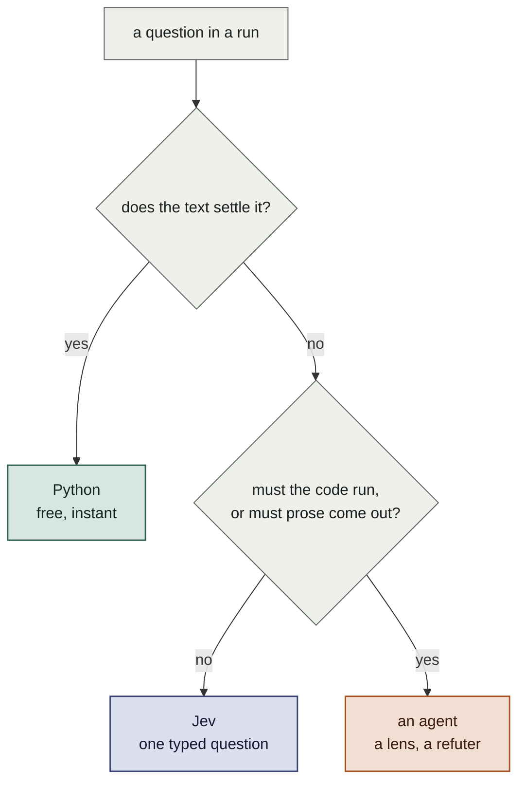

# Jev in clerk — a third tier between a regex and an agent

## What it is

A small client, `clerk_jev.py`, and nine call sites that use it. Jev is TypeSafe's System
One model. It takes a state and a map of typed questions, and it returns a typed answer
with a calibrated confidence. It writes no text and runs no tools.

`clerk lint` states the rule the whole system runs on:

> the bar for adding a rule is not "is this in the guidelines" but "does this decide
> without judgment"

That rule gives two tiers. A regex settles it, or an agent reads it. The middle is large,
and today every question in that middle costs an agent.

| Tier | Use it when | Cost |
|---|---|---|
| Python | The text settles it | free |
| **Jev** | **A small judgement settles it, and no code runs** | **~100ms, ~$0.0001** |
| Agent | The answer needs the code to run, or needs prose | minutes, dollars |



The colours follow [clerk-structure.md](../clerk-structure.md). Green is what clerk
decides from evidence. Terracotta is what the model judges. Blue is the new fill: a
judgement clerk asks for and gets back as a number.

## Where it sits

Jev is not an agent and not a skill, so it replaces neither. A skill is prose a model
reads. Jev is a function a program calls.

That difference decides the placement. Jev has no tools, reads no file and writes no text.
Something must assemble the state, ask the question and act on the number. A skill cannot:
a skill asks a model to remember to. `clerk` can.

| Placement | Fits | Sites |
|---|---|---|
| Inside a program the skill already calls | yes | all nine |
| In place of a paragraph inside a skill | yes | 5, 6 |
| In place of a subagent | yes | 3 |
| In place of the skill | no | — |

The model could run `clerk jev ask` itself. That works, and it is the wrong design, for the
reason clerk exists at all. [clerk-structure.md](../clerk-structure.md) states it: a rule
written down for a model is a rule the model follows part of the time, and a skipped step
is silent.

Site 5 is the clean case. The audit step asks the model to check by hand whether the diff
holds any code, because the short-circuit costs a round trip. That is a rule with no
enforcement. One Noul inside `clerk audit run` deletes the paragraph, and the launch
refuses instead. The skill gets shorter and the gate gets real.

So Jev replaces instructions inside a skill. It does not replace a skill. It decides
nothing about what comes next, it writes no code and it returns no string: the skill still
holds the order of the work, and the model still does the work.

One placement stays out of scope. Jev can also gate a tool call before it runs, below every
skill, which in Claude Code is a `PreToolUse` hook. That is a different project, and
nothing here needs it.

## Why now

The audit path is expensive and the lint docstring measures it: an audit raised 773
findings to confirm 282. Each refuted one cost a verifier agent minutes of execution to
establish that nothing was wrong. Every rule that stays out of `clerk lint` because it
needs judgement ends up on that path.

Jev does not replace a lens. It moves the rules a lens settles when it reads the code,
and it fixes three checks that Python settles wrongly today.

## What I checked, and what I did not

Taken from the TypeSafe documentation and the LiteLLM pass-through page:

| Fact | Value |
|---|---|
| Endpoint | `POST https://api.typesafe.ai/v1/systemone` |
| Auth | `Authorization: Bearer <API_KEY>`, `Content-Type: application/json` |
| Request | `state`, `model`, `questions` (a map of question id to question object) |
| Question object | `type`, `instructions`, `criteria`; `options` or `levels` by type |
| Primitives | `choice` (pick one), `score` (2–10 ordered levels), `noul` (0–1) |
| Response | `answers` keyed by question id, plus `usage` |
| Choice answer | `choice`, `probabilities`, `confidence` |
| Parallel | Every question in one request is answered in parallel and in isolation |
| Limits | 255 options per choice, 64K state tokens per request |
| Errors | 401 auth, 422 validation, 429 rate limit, 529 overloaded |

The verbatim example from the LiteLLM page:

```json
{
  "state": "Help! My payouts have been failing for 3 days.",
  "model": "jev-latest",
  "questions": {
    "department": {
      "type": "choice",
      "instructions": "Which team should handle this?",
      "criteria": {
        "billing": "Payments, invoicing, refunds",
        "technical": "Bugs, outages, integrations",
        "sales": "Pricing, upgrades, new accounts"
      }
    }
  }
}
```

```json
{
  "model": "jev-1.13.0",
  "answers": {
    "department": {
      "type": "choice", "choice": "technical",
      "probabilities": {"billing": 0.08, "technical": 0.85, "sales": 0.07},
      "confidence": 0.82
    }
  },
  "usage": {"input_tokens": 312, "output_tokens": 48}
}
```

**Not checked.** There is no `TYPESAFE_API_KEY` on this machine, so no request was run
against the live endpoint. The example above comes from a proxy's documentation. The
reported price is $0.042 per million input tokens with no output charge, and the reported
latency is 70–500ms; I read both in a search result and did not open the pricing page.

**The first task is therefore one real request.** Confirm the field names of a `score` and
a `noul` question, the shape of their answers, and the latency from this machine. Nothing
below is worth a line of code until somebody has sent that request.

## The client

`clerk` imports nothing outside the standard library. Every import across the
seventeen commands and the thirteen modules resolves to `clerk_*`, or to `json`, `re`,
`os`, `subprocess`, `pathlib`, `argparse`, `hashlib`, `threading` and their siblings.

So the client uses `urllib.request`, not `pydantic-ai`. A CLI that installs a dependency
tree to decide whether a test ran is a CLI that stops working on a machine somebody has
not prepared.

```python
"""clerk jev — a typed judgement, for the questions a regex decides wrongly.

Every call here has a fallback and a floor. clerk must run with no network and must never
block a landing because an API was slow. A question that cannot be answered returns the
answer clerk gives today, and the run says so.
"""

import json
import os
import urllib.error
import urllib.request

ENDPOINT = "https://api.typesafe.ai/v1/systemone"
MODEL = "jev-latest"
TIMEOUT = 5.0


def available():
    return bool(os.environ.get("TYPESAFE_API_KEY"))


def ask(state, questions, *, timeout=TIMEOUT):
    """The answers map, or None when the question cannot be asked. Never raises: a caller
    that has to handle an exception to keep working will one day not handle it."""
    key = os.environ.get("TYPESAFE_API_KEY")
    if not key or not questions:
        return None
    body = json.dumps({"state": state, "model": MODEL, "questions": questions}).encode()
    req = urllib.request.Request(ENDPOINT, data=body, headers={
        "Authorization": f"Bearer {key}", "Content-Type": "application/json"})
    try:
        with urllib.request.urlopen(req, timeout=timeout) as r:
            return json.load(r).get("answers")
    except (urllib.error.URLError, OSError, ValueError, json.JSONDecodeError):
        return None


def noul_q(instructions, criteria=None):
    q = {"type": "noul", "instructions": instructions}
    if criteria:
        q["criteria"] = criteria
    return q


def choice_q(instructions, criteria):
    return {"type": "choice", "instructions": instructions, "criteria": criteria}


def score_q(instructions, levels):
    return {"type": "score", "instructions": instructions, "levels": levels}
```

Three rules hold at every call site.

1. **A fallback is mandatory.** It is the answer clerk gives today. No site gains a new
   way to fail.
2. **A floor and a ceiling.** Jev overrides the fallback only outside them. Between them
   the fallback stands, or the site reports the question as not checked.
3. **Every answer reaches the ledger**, with its confidence and the question id. That is
   what makes rule 2's numbers measurable later.

A `clerk jev ask <file>` subcommand puts the same client in front of `deliver.sh` and any
other shell caller, so the thresholds live in one file rather than in each script.

## The call sites

### 1. `clerk verify` — the receipt that says nothing ran

`clerk_verify.py:16` decides whether a suite ran with a regex over the receipt tail.

```python
VACUITY = re.compile(r"no files changed|no tests to run|no test files|0 passed|...", re.I)
```

It blocks a valid `make test` receipt in the platform repo, every time. A landing gate a
run cannot pass is worse than no gate, because the model then works around it.

```python
def vacuity(tail, *, jev=True):
    mechanical = _vacuity_regex(tail)
    if not jev:
        return mechanical
    a = (clerk_jev.ask(tail[-40000:], {"vacuity": clerk_jev.noul_q(
        "No test executed in this run.",
        {"true": "The output reports that no test file, no package and no case ran.",
         "false": "At least one test case executed, whatever its result."})}) or {})
    v = (a.get("vacuity") or {}).get("value")
    if v is None:
        return mechanical
    if v >= 0.85:
        return mechanical or "the output shows that no test executed"
    if v <= 0.15:
        return None
    return mechanical
```

One question, one gate, a failure mode that costs a whole run today. Build this one first.

### 2. `clerk lint` — the rules the file cannot hold

`clerk-lint:114` carries nine regexes for `comment-plan-position`. Beside them sit a
`TICKET` regex and a `NOT_A_TICKET` deny list of twelve abbreviations — `UTF`, `SHA`,
`RFC`, `ISO` and the rest. That list is the tell. The rule needs judgement, and the code
imitates it with vocabulary. `SCENARIO_VERBS` at `clerk-lint:217` does the same for
`test-umbrella`.

Keep the regexes as a prefilter, because they cost nothing and they bound the request.
Send every added comment line of a file as one question each, in one request.

```python
QUESTION = clerk_jev.noul_q(
    "This comment names the code by its position in a plan, a ticket, a pull request or a "
    "change, rather than by what the code does.",
    {"true": "It cites a task number, a step, a phase, a wave, a deliverable, a ticket id, "
             "a pull request or a design document; or it describes the edit rather than "
             "the behaviour the code has now.",
     "false": "It explains what the code does, or why the code is the way it is."})


def check_comments(root, path, rng, *, jev=True):
    hits = _regex_hits(root, path, rng)
    if not jev or not hits:
        return hits
    answers = clerk_jev.ask({"file": path, "comments": {str(n): t for n, t in hits}},
                            {str(n): QUESTION for n, _ in hits}) or {}
    return [(n, t) for n, t in hits
            if (answers.get(str(n)) or {}).get("value", 1.0) >= 0.7]
```

Two gains, and the second is the larger one.

The false positives fall, so a refusal stays a defect rather than an opinion to argue
with. `clerk finish` refuses the whole step on a lint finding, so a wrong finding costs the
model a detour and teaches it to distrust the gate.

And rules the docstring excludes on purpose become writable. Two that sit in the
guidelines today and reach an audit lens instead:

- a comment that restates the name of the thing below it
- a test name that describes an implementation detail rather than a behaviour

Each is a Noul. A reader settles each one. Neither is a regex.

### 3. The audit dedupe phase — delete an agent

`clerk-audit:421` spawns an agent to group candidate findings. `merge_clusters`
(`clerk_audit_panel.py:303`) then throws the whole grouping away when it does not account
for every finding exactly once, because an agent has been seen to drop one.

Ask instead, one finding at a time, against the representatives already chosen:

```python
def dedupe_clusters(candidates, floor=0.55):
    reps, members = [], []
    for f in candidates:
        if not reps:
            reps.append(f); members.append([f]); continue
        options = {str(r["id"]): f'{r.get("severity")} {r.get("file")}: {r.get("claim")}'
                   for r in reps[:254]}
        options["none"] = "This finding names a defect none of the others name."
        a = (clerk_jev.ask({"finding": f, "earlier": reps},
                           {"same": clerk_jev.choice_q(
                               "Which earlier finding names the same defect as this one?",
                               options)}) or {}).get("same") or {}
        pick, conf = a.get("choice"), a.get("confidence", 0.0)
        if pick and pick != "none" and conf >= floor:
            members[[str(r["id"]) for r in reps].index(pick)].append(f)
        else:
            reps.append(f); members.append([f])
    return [_merged(m) for m in members], len(candidates) - len(reps)
```

Completeness is now a property of the loop. Every finding lands in exactly one cluster
because the loop puts it there, so the reject path and the warning it prints both go away.
`premerge` stays: an identical id needs no judgement.

The 255-option cap holds a round's candidate list. A round that exceeds it is a round with
more than 254 distinct findings, which has its own problem.

### 4. `repeated_gaps` and `declined_match` — a threshold nobody measured

`clerk-audit:127` reduces a gap to its content words. `repeated_gaps` and `declined_match`
then call two texts the same when their word sets overlap by 0.6 of the smaller.

Three decisions ride on that number. Whether a gap repeats, which the method treats as the
signal to read those files by hand. Whether a lens re-raised a finding the author declined,
which decides whether the user pays for it again. And through `earns_another`, whether a
further round runs at all.

A Noul answers the question the code is trying to ask:

```python
PAIR = clerk_jev.noul_q(
    "Statement B names the same uncovered ground as statement A.",
    {"true": "Both name the same files, the same behaviour or the same missing check, "
             "whatever words they use.",
     "false": "They name different ground, even where both concern one file."})
```

Keep the word-set overlap as the prefilter at a low threshold, so the pair count stays
bounded, then ask one question per surviving pair in a single request. The threshold then
means something, and `declined_match` stops being a coin toss on wording.

### 5. The audit scope short-circuit

`~/.config/ai/method/implement/steps/audit.md` asks the model to apply the no-code test
by hand before it launches, *because the short-circuit still costs a round trip*. A rule
written in a method paragraph is a rule the model applies when it remembers to.

One Noul inside `clerk audit run`, over the changed-file list, refuses the launch:

```python
clerk_jev.noul_q(
    "Every changed file in this list is documentation, configuration or build plumbing.",
    {"true": "Markdown, text, JSON, YAML, TOML, lock files, Makefiles, images.",
     "false": "At least one file holds code that executes."})
```

The paragraph then describes the refusal rather than asking for the check.

### 6. The round-earning rule

`earns_another` (`clerk-audit:278`) is the largest lever anyone has over what a run costs.
It reads `nature`, which each lens reports about its own finding.

One Choice per upheld finding re-classifies it against the fixed definition — `runtime` is
a defect something executes, `quality` is a convention or a test shape. The gate stops
resting on a lens's word about itself, at a cost of one request per round.

### 7. `certainty` and `blast_radius` — score them again at the build step

These two are Score questions by definition, and Score takes 2–10 ordered levels with
descriptions. Today the decompose agent writes them once, before any code exists, and
`steps/build.md` in the same tree tells the model to *drive on what you found rather
than on what the breakdown said*. That instruction admits the numbers go stale.

`clerk step` re-scores each task as it hands it out, against the task text, the files it
names and the precedent it cites. `gears` then reacts to the repository rather than to a
plan.

The confidence value is the part `gears` wants most. A certainty score Jev is unsure about
is itself the reason to pause after the tests — and it is a reason the breakdown cannot
express, because a breakdown states a level and never states how sure it is of it.

### 8. `deliver-story` — the monitor loop asks the wrong question

The watcher in Phase 3 counts five stable polls, then splits `DONE` from `STOPPED` by
arithmetic over commits and ticked tasks. It cannot tell a crashed run from a finished one,
and the skill says so.

One Choice over the pane tail and the sidecar counts answers the real question in about a
tenth of a second:

```python
clerk_jev.choice_q("What is this run doing?", {
    "finished": "It reported every task done and its tree is clean.",
    "waiting_for_input": "It stopped at a question or a permission prompt.",
    "crashed": "It stopped part way, with work unfinished and no question asked.",
    "still_working": "It is between turns, or a command of its own is running."})
```

Two more in the same request. A Noul over `workmux capture` output settles whether a
`waiting` pane wants a person — the skill says it *usually* does, which is a guess the
driver acts on. And a Score at the plan gate rates how far past one reviewable pull request
each deliverable's cut is, which replaces a file count and a 3–7 task band with a number
that describes the thing it claims to.

## Where Jev does not go

- **The refuters.** They mutate the working tree to prove a claim. That is execution, and
  Jev has no tools. The test-integrity lens is the reason the audit is worth its cost.
- **Anything that writes prose.** Commit messages, findings, learnings, PR bodies. Jev
  produces no string output.
- **The one human gate in `deliver-story`.** A confidence value is not approval.
- **A landing, on its own.** Every site keeps its fallback. An API that is down must slow
  nothing and block nothing.

## Calibration

Each threshold above is a number somebody must measure. clerk already holds the data.

| Site | The set to measure against |
|---|---|
| 1 vacuity | Every receipt in the ledger, and whether its suite really ran |
| 2 lint | Every finding `clerk finish` refused, and whether the author fixed it |
| 3 dedupe | Every round's candidates and the clusters the agent proposed |
| 4 gaps | Every round's gap texts, which `clerk audit` already keeps |
| 6 nature | Every upheld finding and whether the next round found more |

Record every Jev answer with its confidence from the first day, before any site acts on
one. A threshold chosen from a run's own history is a different object from a threshold
somebody picked.

## Order of work

1. One real request. Confirm the wire shape and the latency from this machine.
2. `clerk_jev.py`, `clerk jev ask`, and the ledger record. No call site changes yet.
3. Site 1. One gate, one question, the failure mode that costs most.
4. Sites 5 and 6. Both live inside `clerk audit run` and both are one question.
5. Site 4, then site 3. Site 3 deletes an agent and a reject path.
6. Site 2, then the rules it unlocks.
7. Site 7, then site 8.

Each step lands on its own. Nothing after step 2 depends on anything but step 2.
