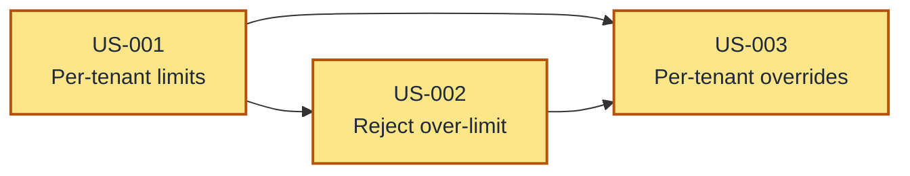
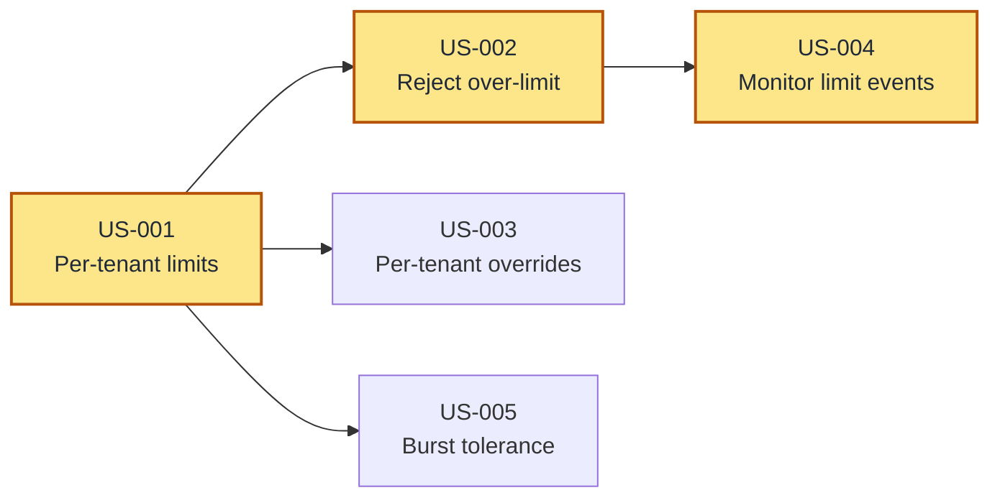

<!-- Generated from link/common/dot-config/.config/ai/method/write-user-story/body.md by scripts/gen-skills.sh. Do not edit this file - edit the source and run `task common:gen`. -->

# User Story Writer

Create detailed, actionable user stories suitable for implementation by a developer or AI agent.

---

## The Job

1. Receive a feature description from the user
2. Ask clarifying questions if the description is ambiguous (with lettered options)
3. Generate structured user stories based on answers, and merge the stories that must ship together
4. Draw the dependency diagram from the stories' **Depends on** fields
5. Save to `user-stories/[feature-name].md`
6. If the feature adds to or changes an event model, build the story map (Step 4)
7. Ask if any stories need splitting, merging, reprioritizing, or if new stories are needed

**Important:** Do NOT start implementing. Just create the user stories.

---

## Important Restrictions

- NEVER include implementation details or technical solutions
- NEVER suggest code examples or programming approaches
- NEVER write test cases or mention testing frameworks
- NEVER provide technical architecture or design guidance
- Focus on user needs, business value, and acceptance criteria
- When the domain is inherently technical (APIs, infrastructure, developer tools), use precise domain terminology in acceptance criteria — this is not the same as prescribing implementation
- If asked about implementation, redirect to user story refinement
- The story map (Step 4) is the one exception. It shows the event model that the stories change, and it is a separate file. The stories file stays free of events, automations and gates.

---

## Step 1: Clarifying Questions

Ask only critical questions where the initial prompt is ambiguous. If the user's description is sufficiently detailed, reduce to 1-2 targeted questions or proceed directly and note assumptions in the Open Questions section.

Tailor every question to the specific feature described. Never ask generic questions like "What is the scope?" — instead ask something derived from the feature, like "Should the rate limiter apply per-endpoint or per-tenant?"

Focus on:

- **Problem/Goal:** What problem does this solve?
- **Core Functionality:** What are the key actions?
- **Scope/Boundaries:** What should it NOT do?
- **Success Criteria:** How do we know it's done?
- **User Personas:** Who are the different types of users?

### Format Questions Like This:

Given a feature request like "Add rate limiting to our API":

```
1. Which consumers should rate limiting apply to?
   A. External/public API consumers only
   B. All consumers including internal services
   C. Specific tenant tiers (e.g., free vs. paid)
   D. Other: [please specify]

2. What should happen when a consumer exceeds their limit?
   A. Reject with an error and retry guidance
   B. Queue excess requests and process them later
   C. Throttle (slow down) rather than reject
   D. Other: [please specify]

3. Should limits be the same for everyone or configurable?
   A. Single global limit for all consumers
   B. Configurable per tenant/consumer
   C. Tiered limits based on plan level
   D. Other: [please specify]
```

This lets users respond with "1A, 2A, 3B" for quick iteration. Remember to indent the options.

---

## Step 2: Decompose into User Stories

Apply the **Elephant Carpaccio** technique: break the problem into the thinnest possible vertical slices that still deliver end-to-end value. Each slice should be a complete, working feature that a user can interact with.

Every user story must follow the **INVEST** criteria:

- **Independent:** Can be developed without dependencies on other stories
- **Negotiable:** Details can be discussed and refined
- **Valuable:** Delivers clear value to the end user
- **Estimable:** Clear enough scope to understand complexity
- **Small:** Can be completed in a single focused session
- **Testable:** Has clear acceptance criteria

### Story Sizing

A well-sized story should have 3-7 acceptance criteria. If you have more than 7, the story likely needs splitting, unless its parts must ship as one increment (next section). If fewer than 2, it may be too granular to stand alone.

### Stories That Must Ship Together Are One Story

Each story must be safe to ship alone. Before you draw the Delivery Order, test each **Depends on**: if the prerequisite ships alone, does it leave the product worse? Examples are a public page with no limit on guesses, a flow that misbehaves until the next story lands, or a gap that a user falls into. If yes, the two stories are one increment, so merge them into one story.

- Two stories that the design delivers in the same step are not one increment for that reason alone. Keep them separate when each one delivers value alone, or when each one serves a different user.
- A merged story can have more than 7 acceptance criteria. Keep it whole, and merge criteria that say the same thing. In its **Context**, say why its parts ship as one. The implementer splits it into tasks, not into stories.

### Prioritize and Sequence Stories By:

1. Risk reduction (tackle unknowns early)
2. User value delivery
3. Dependencies between stories
4. Learning opportunities

List stories in recommended implementation order. When a story depends on another, note the dependency explicitly.

---

## Step 3: Document Structure

Generate the document with these sections:

### 1. Overview
Brief description of the feature and the problem it solves.

### 2. Goals
Specific, measurable objectives (bullet list).

### 3. Delivery Order

A Mermaid diagram of the dependency graph, followed by two or three sentences reading it. Place it before the stories so it orients the reader.

Build it from the **Depends on** fields, with arrows pointing from prerequisite to dependent — the reverse of how each story states it. The edges and the **Depends on** fields must agree exactly; a diagram that has drifted from the stories is worse than none.

**Format:**

````markdown
## Delivery Order



[Two or three sentences: what everything blocks on, and how deep the critical path runs.]
````

Rules:

- **`flowchart LR`**, so dependency depth reads as columns left to right
- **One node per story**, labelled with its ID and a title short enough to stay legible — abbreviate the story title rather than wrapping it over three lines
- **Shade the critical path** (the longest chain) with the `classDef`, and say how deep it runs. That number is the floor on delivery time no amount of parallelism removes
- **Leave the edges unlabelled.** Each edge means only that the dependent story needs the prerequisite first. Never label an edge "ships together": two stories that must land as one increment are one story (Step 2)
- **Name the bottleneck in prose.** A story that many others depend on is the one to start, and saying so is the diagram's main job
- **When no story depends on another**, write one line saying they can be built in any order and skip the diagram

### 4. User Stories

Each story needs:
- **Title:** Short descriptive name
- **Ticket** *(once the tickets exist)*: The ID of the story's ticket in the tracker. `clerk project` finds the plan of a story by this ID, because the plan that `/deliver-story` writes carries the same ID in its `ticket:` field
- **Description:** "As a [user], I want [feature] so that [benefit]"
- **Acceptance Criteria:** Verifiable checklist of what "done" means — how we verify this story works
- **Context** *(optional)*: Background information helpful for the implementer — domain knowledge, related behavior elsewhere in the system, or why this story exists. Do not prescribe solutions.
- **Depends on** *(optional)*: References to stories that must be completed first

**Format:**
```markdown
### US-001: [Title]
**Ticket:** [Once the ticket exists, e.g., AGE-969]

**Description:** As a [user], I want [feature] so that [benefit].

**Acceptance Criteria:**
- [ ] Specific verifiable criterion
- [ ] Another criterion

**Context:** [Optional background for the implementer]

**Depends on:** [Optional, e.g., US-001]
```

**Important:**
- Acceptance criteria must be verifiable, not vague. "Works correctly" is bad. "Consumer receives a 429 response with retry timing when their request rate exceeds the configured limit" is good.
- Acceptance criteria describe observable behavior — what the user sees, what the system responds with, what state changes. They are not implementation instructions.

### 5. Non-Goals (Out of Scope)
What this feature will NOT include. Critical for managing scope.

### 6. Open Questions
Remaining questions, areas needing clarification, and any assumptions made if clarifying questions were skipped.

---

## Quality Standards

- Each story should be small enough for a single focused session (3-7 acceptance criteria)
- Each story is safe to ship alone. Stories that must ship together are one story
- Stories should build incrementally toward the full solution
- Avoid technical tasks disguised as user stories — every story should deliver value a user or operator can observe
- Cross-cutting constraints (backward compatibility, performance, security) are not stories. They are properties every story must satisfy. Evaluate each story against these constraints instead of making them standalone items.
- Validation, error handling, and correctness are implementation mechanisms, not user-facing features. Express them as acceptance criteria within the relevant feature story (e.g. "Invalid input produces a clear error message" under an authoring story), not as separate stories.
- Include edge cases and error scenarios as separate stories when significant
- Consider different user personas and their unique needs
- The complete set of stories must address the original problem without gaps or overlaps

---

## Writing for Implementers

The reader may be a junior developer or AI agent. Therefore:

- Be explicit and unambiguous in descriptions and acceptance criteria
- Avoid jargon or explain it
- Use concrete examples where helpful
- Use the optional **Context** field to provide domain background that helps the implementer understand *why* without prescribing *how*

---

## Step 4: Story Map (features that change an event model)

When the feature adds events, automations or gates to an event model, or changes them, also write a story map. The story map is an interactive HTML page: the event flow of the feature, with a chip on each part that a story adds or changes. A reader sees which story builds which part without a read of the stories. Select a story, and its parts light up. Select a part, and the page shows its stories.

Next to the flow, the page draws a graph of the story dependencies from `deps`, one column for each delivery step, with the critical path shaded. When a story is selected, the stories that it depends on turn purple in the graph, and their parts stay in a faded tone on the flow. So the reader sees what the story builds on. A dependency that shares no part with the story is about the order of the work, for example agent load, and not about what the story uses.

A slice of value is not a slice of the event model. One story usually crosses several slices of the model, and some stories only add scenarios to a slice that exists. The story map shows this, so do not try to make the stories match the slices of the model.

**Input:** the event-flow SVG of the feature. If none exists, draw it first, with the `draw-event-flow` skill when it is installed. Take the facts from the code or from the event model, not from the names: which automation reacts to which event, and which gate stands on which edge.

**Build:** start from `~/.config/ai/method/write-user-story/templates/story-map.html`. It holds the page, the styles, the script and a small example. Replace these parts:

- The title, the heading, and the link to the stories file
- The example SVG, with the event-flow SVG of the feature. Keep the `.sm-chip-bg` and `.sm-chip-t` rules of the template, and their dark variants, in the `<style>` of the SVG.
- `STORIES`, with one entry for each story: `id`, `title`, `value` (the "so that" of the story, as one sentence) and `deps` (its **Depends on**)

Then mark up the SVG:

- Wrap each node, each edge and each edge label in `<g class="sm-part" data-name="..." data-stories="...">`. `data-stories` lists each story that adds, changes or uses that part. Leave it empty for a part that works as today. Keep the paint order of the source SVG: edges, then nodes, then labels.
- Put a chip only where a story makes its change. Add `data-chips` to the part, `data-chip-pos` for the place of the chip, and the class `sm-anchor` on the element that the chip attaches to:
  - A new event or a new automation gets the chip on its node (`tr` or `br`). Its own edges need no chip.
  - A new gate, trigger or result on a part that exists gets the chip on the label of that edge (`after`, `before` or `above`).
  - A rule that changes with no new part, for example a rule for each client, gets the chip on the label of the gate or the result where the rule decides.
  - When an automation serves many stories, put the chips on its result edges, not on the automation. Five chips on one node do not show which story adds which result.
- A story with no part in the flow, for example a view, a report or a gate in another flow, gets a small part in a strip "Parts outside this flow". Each story must have at least one chip.
- When two stories own different halves of one line, split the line into two segments.

**Check:** run `~/.config/ai/method/write-user-story/templates/check-story-map.mjs` on the page. It fails on a chip that overlaps another chip or a text, a story with no chip, a chip with an unknown ID, a console error, and a horizontal scroll at 390px.

```bash
node ~/.config/ai/method/write-user-story/templates/check-story-map.mjs user-stories/[feature-name]-story-map.html /tmp/shots
```

The script needs Node and `puppeteer-core` or `puppeteer`. When Node cannot import either from the script's folder, set `PUPPETEER_CORE` to the entry file of any install, for example the one that mermaid-cli bundles. The script uses the installed Google Chrome. To use another Chrome binary, set `CHROME` to its path. If the check cannot run, open the page in a browser, select each story, and look for chips that cover text.

Then look at the screenshot once, with a story selected, and fix what it shows in one pass.

---

## Output

- **Format:** Markdown (`.md`)
- **Location:** `user-stories/`
- **Filename:** `[feature-name].md` (kebab-case)
- **Story map**, for a feature that changes an event model: `[feature-name]-story-map.html` in the same folder, with a link to it in the Overview of the stories file

---

## Iteration

After generating the initial set of stories, ask the user:

- Do any stories need splitting or merging?
- Should any stories be reprioritized?
- Are there missing stories or edge cases to add?

Update the file in place based on feedback. Any change to the story set — splitting, merging, adding, reordering, or a new **Depends on** — means redrawing the diagram and rechecking the critical path in the same edit. A stale diagram misdirects the reader who trusts it over the stories. When a story map exists, update its `STORIES`, its `data-stories` and its chips in the same edit, and run its check again.

When the tickets are created, write the ID of each one into the **Ticket:** line of its story in the same pass. `clerk project` refuses a stories file with a story that has no ticket, because it cannot find that story's plan.

---

## Example

````markdown
# API Rate Limiting

## Overview

Add rate limiting to the public API to prevent abuse and ensure fair usage across tenants. Requests exceeding the configured threshold are rejected with a standard error response, and usage is tracked for observability.

## Goals

- Protect the API from excessive traffic by a single tenant
- Return clear, standards-compliant responses when limits are hit
- Make rate limits configurable per tenant without redeployment
- Provide visibility into rate limit events via monitoring

## Delivery Order



Everything blocks on counting requests: until requests are tracked against a limit, no other story has anything to act on. Once it lands, three stories open at once.

The shaded chain — count, reject, then monitor the rejections — is the critical path at three deep. Nothing else exceeds two.

## User Stories

### US-001: Enforce per-tenant request limits
**Description:** As an API operator, I want incoming requests counted against a per-tenant limit so that no single tenant can monopolize capacity.

**Acceptance Criteria:**
- [ ] Each tenant's requests are tracked against a per-minute limit
- [ ] Default limit is 100 requests per minute
- [ ] Requests within the limit proceed with no noticeable delay

### US-002: Reject over-limit requests with clear feedback
**Description:** As an API consumer, I want a clear error response when I exceed my rate limit so that I know to back off and when to retry.

**Acceptance Criteria:**
- [ ] Over-limit requests receive a 429 status code
- [ ] Response body includes a human-readable error message
- [ ] Response includes how many seconds until the consumer can retry
- [ ] No information about other tenants' limits or usage is leaked

**Depends on:** US-001

### US-003: Allow per-tenant limit overrides
**Description:** As an API operator, I want to set custom rate limits for specific tenants so that premium tenants get higher throughput without affecting others.

**Acceptance Criteria:**
- [ ] Operators can set a custom limit for any tenant
- [ ] Custom limits take effect without restarting the service
- [ ] Tenants without a custom limit use the default
- [ ] Operators can remove a custom limit to revert to the default

**Context:** Premium tenants are identified by their API key tier. The current tenant configuration already supports per-tenant settings for other features.

**Depends on:** US-001

### US-004: Monitor rate limit events
**Description:** As an API operator, I want to see when tenants hit their rate limits so that I can identify abuse patterns and adjust limits proactively.

**Acceptance Criteria:**
- [ ] Each 429 response is recorded as a rate limit event with the tenant identifier
- [ ] Operators can view rate limit events per tenant over time
- [ ] Operators can set up alerts when a tenant exceeds a threshold of 429s

**Depends on:** US-002

### US-005: Handle burst traffic gracefully
**Description:** As an API consumer, I want short bursts above my limit to be tolerated so that legitimate traffic spikes don't immediately trigger errors.

**Acceptance Criteria:**
- [ ] A small burst allowance above the per-minute limit is permitted
- [ ] Sustained traffic above the limit is still rejected
- [ ] Burst allowance is documented so consumers know what to expect

**Context:** Many API consumers send requests in batches rather than at a steady rate. Without burst tolerance, legitimate batch operations would be rejected even if average usage is well within limits.

**Depends on:** US-001

## Non-Goals

- No user-facing dashboard for consumers to view their own usage
- No automatic banning or escalation on repeated violations
- No per-endpoint rate limits (tenant-level only for now)

## Open Questions

- Should rate limit usage headers be included on every response, not just 429s?
- What is the right burst allowance — a fixed number of extra requests or a percentage of the limit?
````

---

## Checklist

Before saving:

- [ ] Asked clarifying questions tailored to the feature (or noted assumptions if skipped)
- [ ] Incorporated user's answers
- [ ] User stories are small (3-7 acceptance criteria) and follow INVEST criteria
- [ ] Each story is safe to ship alone: no prerequisite leaves the product worse until its dependent lands, and no edge says "ships together"
- [ ] Acceptance criteria are verifiable and describe observable behavior
- [ ] No implementation details or technical solutions included
- [ ] Non-goals section defines clear boundaries
- [ ] Stories are listed in recommended implementation order with dependencies noted
- [ ] Dependency diagram's edges match the **Depends on** fields exactly, with the critical path shaded and read out in prose
- [ ] Once the tickets exist, each story has a **Ticket:** line with its ID
- [ ] Saved to `user-stories/[feature-name].md`
- [ ] For a feature that changes an event model: story map written, each story has a chip, and `check-story-map.mjs` passes
- [ ] Asked user if stories need splitting, merging, or reprioritizing
