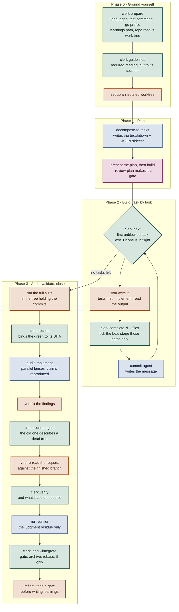
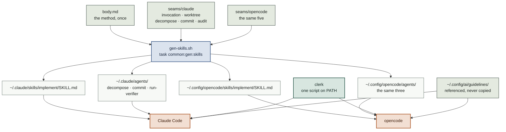

# The shared method layer

`implement` and the agents it invokes are defined once here and rendered into both
Claude Code's and opencode's trees. Everything in the method that needs no judgment
lives in `clerk`, a shell tool both harnesses call.

```
~/.config/ai/
├── guidelines/                 read by both tools, referenced never copied
└── method/
    ├── implement/
    │   ├── body.md             the method, once
    │   └── seams/{claude,opencode}/
    │       ├── invocation.md   how the request arrives
    │       ├── worktree-setup.md
    │       ├── worktree-teardown.md
    │       ├── decompose.md    how a subagent is spawned
    │       ├── commit.md
    │       ├── audit.md
    │       ├── verify.md
    │       └── error-handling-extra.md
    └── agents/
        ├── decompose-to-tasks/{body.md,seams/*/frontmatter.md}
        ├── commit/
        └── run-verifier/
```

Edit `body.md` or a seam, then run `task common:gen:skills`. Never edit a generated
`SKILL.md` or agent file — each carries a header saying so, and
`task common:gen:skills:check` fails when one is stale.

---

## The one idea

A skill is a prompt. Every rule in it holds only for as long as the model follows it,
and rules that are pure mechanics — which test command wins, which task is next,
whether a green receipt describes the tree about to be landed — are exactly the ones a
program follows perfectly and a prompt follows most of the time.

Two defects made the case concretely.

- Phase 3 said to run the suite and the verifier "in the main tree" while the session
  is inside a worktree. The main checkout sits on the default branch without a line of
  the feature in it, so the suite tests the wrong tree and passes for the wrong reason,
  and the verifier finds no commits and reports clean.
- The suite ran before the audit, fixes were applied after, and nothing re-ran it — so
  the gate read "full suite green" off a receipt describing a tree that no longer
  existed.

Both are stated correctly in prose, and stating them is not enough. `clerk` makes them
unrepresentable: `clerk prepare` resolves the tree with `git rev-parse --show-toplevel`,
and `clerk gate` compares the recorded receipt's SHA to `HEAD`.

> Mechanics leave the prompt. Judgment stays with the model. Portability is a
> consequence of that split, not the reason for it.

---

## The run



Green is `clerk`, orange is the model's own work, blue is a delegated agent, pink is the
one human gate.

The middle band is the loop: `clerk next` → build → `clerk complete` → commit agent →
back to `clerk next`. Construction is never delegated. Profiling four fully-delegated
runs over one feature — 139 agents, 11.3 hours — put 64% of wall clock in construction
and its retries, while a comparable feature built directly took 7 minutes.

### Phase 0 — ground yourself

One `clerk prepare` call replaces the resolution recipes that would otherwise be shell
pasted into the skill for the reader to execute. It returns the language inventory
(every marker matched, not just the first), the test-command map, the Go tool prefix,
the learnings path, and — separately — `repo_root` and `work_tree`, because inside a
worktree those differ and confusing them is how a suite ends up testing the wrong
checkout.

Then `clerk guidelines` prints the required reading for those languages, cut to the
sections a run must have loaded. That step is why the skill exists: nothing else hands
over the project's rules, and finding out at review costs more than loading them costs
up front — which is exactly why the twenty-call fetch protocol it replaces was the step
that got shortened under time pressure.

### Phase 1 — plan

`decompose-to-tasks` writes `tasks/<story>.md` and, beside it, `tasks/<story>.json`.
The markdown describes the tasks in prose
and the sidecar carries the dependency graph and the run's progress. Nothing rewrites
the markdown afterwards. Then the only gate before code.

A breakdown that predates the sidecar has none, and `clerk next` refuses rather than
guessing. `clerk sidecar` recovers one by reading the `### Task N:` sections and their
`**Depends on:**` lines, and prints what it extracted so the edges can be checked. It is
a recovery path, not a source of truth — a misread edge reorders work silently — so it
is an explicit command rather than something `next` does behind your back.

### Phase 2 — build, task by task

`clerk next` returns the first task whose dependencies are all checked off, and exits 3
while the tree is dirty — one task in flight at a time is what keeps a run resumable.

`clerk finish N -- <files>` marks the task done in the sidecar and stages it alongside
exactly those paths, so the progress record and the change it stands for land in one
commit. It also stages the breakdown **if the run has modified it** — each task section
carries its acceptance criteria as checkboxes, ticked by hand as they are verified, and
leaving those outside the commit would strand them and dirty the tree. It refuses a path that does not exist, refuses a task already done, and never
runs `git add -A`.

The message is judgment, so it goes to the commit agent. The four prove-it checks — a
guard shown to fail, an absence assertion with a positive partner, a source-scanning
test re-verified after a move, and looking at UI in a browser — stay with the model.

### Phase 3 — audit, validate, close

Suite, then receipt. Audit, fix, then **receipt again** — this is the only point in the
run where code lands after the last green. Re-audit narrowed to the lenses that raised
what was fixed, widening to the full panel if any fix touched behaviour.

Then the step no machine does: re-read the request verbatim against the finished branch
and ask what it asked for that the branch does not do. `clerk verify` handles the
mechanical checks and reports what it could not settle; `run-verifier` works only that
residue. `clerk land` gates, archives on the feature branch, and integrates only when
asked.

---

## What moved, and what could not

The test for whether something belongs in `clerk` is not "is it tedious" but "does the
model add anything by doing it". Where the answer is no, the model can only deviate.

```mermaid
flowchart LR
  subgraph M["clerk · mechanical"]
    direction TB
    m1["which test command,<br/>by precedence"]
    m2["which task is next,<br/>by dependency"]
    m3["what may be staged,<br/>and the task marked done with it"]
    m4["whether the green<br/>describes this tree"]
    m5["whether the branch<br/>may land"]
    m6["staged tails, vacuous<br/>receipts, unreferenced symbols"]
  end
  subgraph J["the model · judgment"]
    direction TB
    j1["what the tests<br/>should assert"]
    j2["writing the code"]
    j3["whether a finding<br/>is real"]
    j4["whether the branch delivers<br/>what was asked"]
    j5["whether one commit<br/>mixes two concerns"]
  end
  M -.->|"facts, refusals,<br/>and what it could not settle"| J
  J -.->|"assertions it cannot infer<br/>--audit-accepted"| M
  classDef clerk fill:#D8E6E0,stroke:#2F5D50,stroke-width:1.5px,color:#132520
  classDef you fill:#F2DFD3,stroke:#A8501E,stroke-width:1.5px,color:#3A1A08
  class m1,m2,m3,m4,m5,m6 clerk
  class j1,j2,j3,j4,j5 you
```



The right-to-left arrow matters as much as the other one. "The audit's findings are
fixed or accepted" is a judgment, so `clerk gate` never infers it — the caller asserts
it with `--audit-accepted`, and without that the gate stays shut.

### Command surface

| Command | What it settles | Exit |
|---|---|---|
| `init [--force] [--in-place] [--integrate] [--review-plan]` | Scaffolds `tasks/clerk.json`, every key written out so the file lists what it accepts | 0 · **2** if it exists without `--force` |
| `prepare [--request <text>]` | Repo facts as JSON: languages, test commands, go prefix, learnings path, repo root vs work tree, base, clean, which commit skill to invoke, resolved run flags with their sources, every existing worktree and breakdown with its progress, and `resume` — the part-built run to rejoin, paired with its worktree. Given the request, it applies the flags and `--learnings-path` typed in it as the top layer | 0 |
| `guidelines [--language <L>]... [--caller <p>] [--dom] [--state]` | The required reading for those languages as text: short files whole, long ones cut to the sections a run must have loaded, and a "Not loaded" report for any slot a reorganised guideline no longer satisfies | 0 · **2** no guidelines dir |
| `next` | The first task whose dependencies are done, from the JSON sidecar | 0 · **3** while a task is in flight |
| `sidecar [--force]` | Recovers `tasks/<story>.json` from a breakdown that predates sidecars, seeding `done` from any old ticks | 0 · **2** if nothing parses |
| `status [--all]` | Progress from the sidecar, plus acceptance criteria walked per task; `--all` walks every breakdown in the repo, in flight and archived | 0 |
| `finish <n> -- <files>` | Task marked done in the sidecar, named paths staged with it (`complete` is an accepted alias) | 0 · **2** refused |
| `receipt` | A suite run bound to the SHA it describes | 0 |
| `gate` | Four landing predicates, each with its evidence | 0 open · **1** shut |
| `verify` | Staged tails, vacuous receipts, dead code, boundary arithmetic, plus `not_checked` | 0 clean · **1** block |
| `land [--integrate\|--no-integrate]` | Archive on the branch; integrate when asked or when the repo says so | 0 · **1** · **3** after a live rebase |

Every command takes `--tasks-file` when `tasks/` holds more than one breakdown. Exit 2
is a usage error throughout.

### Per-repo flag defaults

`--in-place`, `--integrate` and `--review-plan` are as often properties of the repo as
of the run — a repo whose build cannot work from a worktree wants `--in-place` every
time — so each is also a setting. Two files, highest first:

```console
$ clerk init --in-place          # scaffolds the tracked file, in_place already on
{"created": ".../tasks/clerk.json", "tracked": true,
 "flags": {"in_place": true, "integrate": false, "review_plan": false}, ...}
```

```jsonc
// tasks/clerk.json — tracked, a team decision. `clerk init` writes it.
{ "in_place": true, "integrate": false, "review_plan": false }

// tasks/.environment — gitignored, machine-local. JSON, or key=value. Hand-written.
integrate=true
```

`init` writes all three keys even when you name only one: JSON takes no comments, so
listing them is the file's only way to say what it accepts. It refuses to overwrite
without `--force`, and it tells you `tracked: false` in a repo that gitignores `tasks/`
— there the tracked tier does not exist and the file is machine-local whatever it says.

`prepare` reports the result as `flags` and what decided each one as `flag_sources`.
Unrecognised values read as `false`: a typo must never be what turns integration on.

**The request outranks both files, in both directions.** `--worktree`, `--no-integrate`
and `--no-review-plan` turn off what a file switched on, which is what makes defaulting
one on safe to begin with. `land` is the only command that consumes a flag itself, so it
applies `integrate` in code; the other two are resolved by `prepare` and read by the
prose, because they change what the model does rather than what a command does.

> Precedence deliberately matches `test_command`: a tracked team decision beats a
> machine-local preference beats a built-in default. One ladder, learned once.

### Where progress lives

| File | Holds | Written by |
|---|---|---|
| `tasks/<story>.json` | The dependency graph and **`done` per task** — the only record of progress | `decompose-to-tasks`, `clerk sidecar`, `clerk finish` |
| `tasks/<story>.md` | The tasks in prose: behaviour, criteria, affected files, dependencies | `decompose-to-tasks`; nothing rewrites it afterwards |
| `<git-dir>/clerk/*` | The suite receipt, the archive record, each task's file list | `clerk receipt`, `clerk land`, `clerk finish` |

**One place, deliberately.** The breakdown used to carry a `- [ ]` checklist as well, and
two files holding the one fact a resumed run depends on can disagree — while a mirror
that has gone stale still reads as the answer to whoever opens it. `clerk status` prints
progress when a human wants it; `clerk finish` stages the sidecar with the code, so the
progress record and the change it stands for land in the same commit.

A breakdown from before the change still carries ticks. `clerk sidecar` seeds `done`
from them, so recovering one resumes the run rather than declaring it unstarted.

`clerk sidecar` and `clerk finish` write byte-identical formatting, so the first `finish`
after a recovery shows a one-line `done` flip rather than reformatting the whole file
into someone's task commit.

The files under `<git-dir>/clerk` are internal bookkeeping, not an interface. They sit
inside the git directory so they are per-worktree, never committed, and need no
gitignore entry — and, usefully, agent harnesses refuse writes under `.git/`, so a
failed command cannot be "finished" by hand. That refusal is the guard working, not a
problem to route around: the guarantees come from a command performing its steps
together, and a tree that merely ends up looking similar has none of them.

### Acceptance criteria are reported, never gated

A breakdown's task sections carry their acceptance criteria as checkboxes, ticked by
hand as each is verified. Those are not run progress — they are the record of which
criteria were actually walked, and the only per-criterion evidence a reviewer of the
finished branch can read.

`clerk status` counts them: per task, and as a total, plus
`done_with_unticked_criteria` — tasks marked done that still carry an unwalked
criterion, which is the combination worth looking at.

It is reported and never gated on. Whether a criterion is genuinely met is judgment, and
a script counting boxes would be the wrong authority for it — `gate` reads `done` from
the sidecar and nothing else.

### Reading the format from outside

`clerk status --all` walks every breakdown in the repo and returns each task with its
`done` flag. That exists so nothing else has to learn the sidecar's schema: the global
`task -g progress` reporter calls it and flattens the result, rather than reaching into
`tasks/*.json` itself and becoming a second thing to update when the shape moves.

Whoever owns a format owns its reader.

### Resuming

A stopped run resumes rather than restarting. `clerk prepare` reports every worktree of
the repo with its branch, and every breakdown with how many of its tasks are done, so
the skill enters the worktree it left and adopts the breakdown it was working through
instead of opening a second worktree and decomposing the story again.

### Three refusals worth knowing

- **`next` exits 3 on a dirty tree.** Not a warning — the next task cannot start while
  the current one is uncommitted. `--allow-dirty` exists, but using it to get past
  unfinished work is the failure it was built to stop.
- **`gate` will not open without `--audit-accepted`.** Three predicates are computed;
  the fourth is asserted, because no program decides whether accepting a finding was
  right.
- **`land --integrate` exits 3 after a real rebase.** Green-before-rebase is not
  green-after, so it stops and asks for a fresh suite run and receipt before it will
  fast-forward.

---

## Why this ports

A shared prompt is only as portable as the model reading it. A shell command behaves
identically on both tools *by construction*, so every rule moved into `clerk` stops
being a portability problem at all.

What remains genuinely differs between the harnesses, and that residue is small enough
to enumerate.



A procedure the agent must follow in full is **concatenated, not referenced**: splitting
it into "now read these six files" adds six reads and invites the partial compliance the
arrangement exists to remove. Guidelines are the opposite — consulted on demand, read
partially by design — so they stay referenced.

### The seams

| Seam | Claude Code | opencode |
|---|---|---|
| invocation | the harness substitutes `$ARGUMENTS` into the skill | the wrapper is substituted; the skill is read as a file |
| worktree | `EnterWorktree` / `ExitWorktree` | `git worktree add` + `cd` |
| decompose | Agent tool | `task` tool, self-contained prompt |
| commit | Skill tool → `commit` / `pcommit` | `task` tool → the `commit` subagent |
| audit | a Workflow: deterministic fan-out, schema-validated findings | orchestrated in prose by the model |

Agent definitions add one more seam — frontmatter — and their bodies render
byte-identical across both trees.

### The substitution trap

Claude substitutes `$ARGUMENTS` into a skill when it invokes one. opencode substitutes
it into the *command wrapper*, which then tells the model to read the skill as a file —
so any `$ARGUMENTS` inside that file stays literal text the model must resolve from
memory.

The method therefore never depends on the token. It opens by naming the thing instead:
**the request** is everything the caller handed over, recorded verbatim before anything
else happens, and every later step refers to that record. Three steps need it — whether
`--in-place` was passed, whether an existing breakdown was named, and handing the
request to the audit unsummarized — and all three work the same way on both tools.

### Where the two still differ

- **The audit's orchestration.** Claude runs it as a Workflow with schema-validated
  findings and deterministic fan-out; opencode drives the same lenses from prose. Same
  shape of result, weaker guarantee. This is the candidate for a shared JS runner, left
  unbuilt until the difference demonstrably hurts.
- **Tool restriction.** `run-verifier` is structurally read-only on Claude, because no
  write tool appears in its `tools` allowlist. On opencode the same guarantee rests on
  the prose in its body, since no agent there restricts tools.

---

## Operating it

```
task common:gen:skills         regenerate both trees from the shared method
task common:gen:skills:check   fail if a generated file is stale
task common:test:clerk         the clerk fixture tests
clerk help                     the command surface
```

`clerk` requires `git` and `jq`, targets bash 3.2 so it runs on macOS's system shell,
and is stowed to `~/.local/bin` from `link/common/dot-local/bin/`.

If `clerk` is absent, the skill says to stop rather than hand-execute its resolutions.
Getting the test-command precedence wrong silently tests the wrong thing, which is the
failure it exists to prevent.
