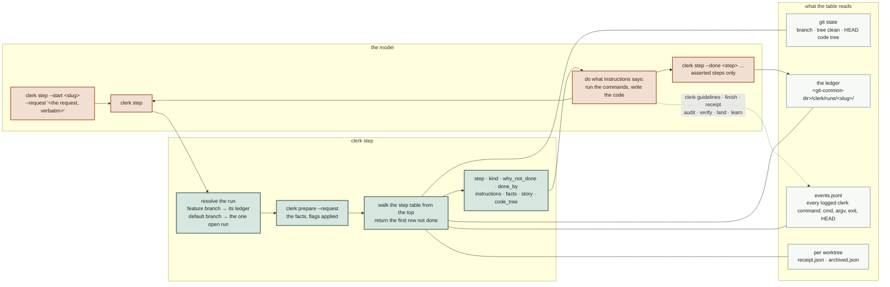
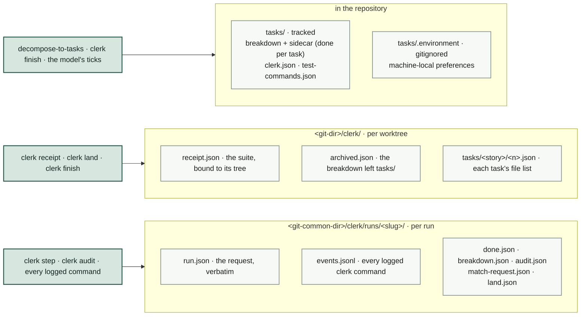
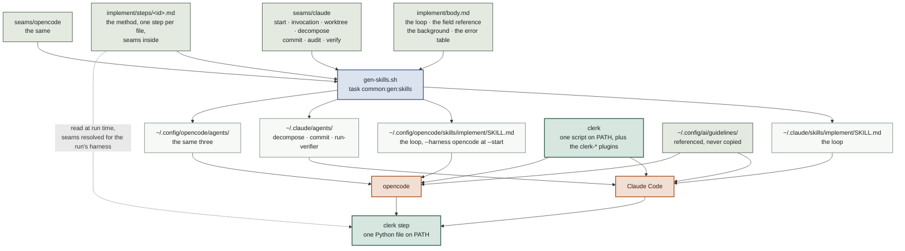

# The shared method layer

`implement` and the agents it invokes are defined once here and rendered into both
Claude Code's and opencode's trees. Everything in the method that needs no judgment
lives in `clerk`, a shell tool both harnesses call.

```
~/.config/ai/
├── guidelines/                 read by both tools, referenced never copied
└── method/
    ├── clerk-step.md           the design note for clerk step
    ├── implement/
    │   ├── body.md             the skill: the shape, the loop, the flags
    │   ├── steps/<id>.md       the method, one step per file — ground, isolate,
    │   │                       decompose, build, suite, audit, match-request,
    │   │                       explain, verify-run, land, learn
    │   └── seams/{claude,opencode}/
    │       ├── start.md        how the run is opened (opencode names the harness)
    │       ├── invocation.md   how the request arrives
    │       ├── worktree-setup.md
    │       ├── worktree-teardown.md
    │       ├── decompose.md    how a subagent is spawned
    │       ├── commit.md
    │       ├── audit.md
    │       ├── verify.md
    │       └── harness-notes.md
    └── agents/
        ├── decompose-to-tasks/{body.md,seams/*/frontmatter.md}
        ├── commit/
        └── run-verifier/
```

Edit `body.md`, a step or a seam, then run `task common:gen` — **not `common:gen:skills`
alone**, which rewrites each agent file from its body and so drops the `model:` line that
`gen-agent-models.sh` stamps in afterwards. Never edit a generated `SKILL.md` or agent
file — each carries a header saying so, and `task common:check` fails when one is stale.

---

## The one idea

A skill is a prompt. Every rule in it holds only for as long as the model follows it,
and rules that are pure mechanics — which test command wins, which task is next,
whether a green receipt describes the tree about to be landed — are exactly the ones a
program follows perfectly and a prompt follows most of the time.

Two defects made the case concretely.

- Phase 3 said to run the suite and the verifier "in the main tree" while the session
  is inside a worktree. The main checkout sits on the default branch without a line of
  the feature in it, so the suite tests the wrong tree and passes for the wrong reason,
  and the verifier finds no commits and reports clean.
- The suite ran before the audit, fixes were applied after, and nothing re-ran it — so
  the gate read "full suite green" off a receipt describing a tree that no longer
  existed.

Both are stated correctly in prose, and stating them is not enough. `clerk` makes them
unrepresentable: `clerk prepare` resolves the tree with `git rev-parse --show-toplevel`,
and `clerk land` compares the code the recorded receipt describes to the code at `HEAD`.

The third defect was the skill itself: 535 lines of procedure whose order lived only in
the model's reading of it. `clerk step` holds the order now, and the skill is one loop.

> Mechanics leave the prompt. Judgment stays with the model. Portability is a
> consequence of that split, not the reason for it.

---

## The run

The skill is one loop. The model opens the run, then asks `clerk step` what comes next,
does that, and asks again; clerk computes the answer from the repository and the run's
ledger, and the next step appears when this one's evidence exists.



The table `clerk step` walks, top to bottom. Green rows are **derived** — clerk checks the
world and the record; orange rows are **asserted** — completion is a judgment, recorded
with `clerk step --done` and stamped with the code tree it applies to; pink is a human
gate. A row names the command that supplies its evidence.

```mermaid
flowchart TD
  START["start<br/>run.json holds the request verbatim"] --> GROUND
  GROUND["ground<br/>a clerk guidelines --caller run exited 0<br/>blocked while the tree is dirty"] --> ISOLATE
  ISOLATE["isolate<br/>branch == slug<br/>clerk isolate"] --> PLAN
  PLAN["decompose<br/>breakdown bound · sidecar present · lint clean<br/>clerk step --done decompose --tasks-file"] --> TASK
  TASK{"task N<br/>first open task with its<br/>dependencies done"} -->|"gears on, and low certainty /<br/>high blast radius / downshifted"| TESTS
  TESTS["pause N · stop: true<br/>clerk step --done pause N"] --> BUILD
  TASK --> BUILD["clerk finish N -- files<br/>stages · lints · marks done<br/>the commit leaves the tree clean"]
  BUILD -->|"tasks open"| TASK
  BUILD -->|"none open"| SUITE
  SUITE["suite<br/>receipt green at this code tree"] --> AUDIT
  AUDIT["audit<br/>clerk audit run · round · accept"] --> VALIDATE
  VALIDATE["match-request<br/>clerk step --done match-request [--mismatch]<br/>blocked until --resolved"] --> THEORY
  THEORY["explain<br/>## Theory in the breakdown, committed"] --> VERIFY
  VERIFY["verify-run<br/>clerk verify clean · residue reviewed"] --> LAND
  LAND["land<br/>clerk land · the gate reads the acceptance<br/>fast-forward from the main checkout"] --> LEARN
  LEARN["learn<br/>a clerk learn write, or --done learn --none"] --> FIN["finished"]
  classDef derived fill:#D8E6E0,stroke:#2F5D50,stroke-width:2px,color:#132520
  classDef asserted fill:#F2DFD3,stroke:#A8501E,stroke-width:2px,color:#3A1A08
  classDef gate fill:#EFD9E4,stroke:#8A2E5D,stroke-width:2px,color:#3A1024
  class START,GROUND,ISOLATE,TASK,BUILD,SUITE,THEORY,VERIFY,LAND,FIN derived
  class PLAN,AUDIT,VALIDATE,LEARN asserted
  class TESTS gate
```



The middle band is the loop: `clerk step` → build → `clerk finish` → commit agent → back
to `clerk step`. Construction is never delegated. Profiling four fully-delegated runs
over one feature — 139 agents, 11.3 hours — put 64% of wall clock in construction and
its retries, while a comparable feature built directly took 7 minutes.

### Phase 0 — ground yourself

One `clerk prepare` call replaces the resolution recipes that would otherwise be shell
pasted into the skill for the reader to execute. It returns the language inventory
(every marker matched, not just the first), the test-command map, the Go tool prefix,
the learnings path, and — separately — `repo_root` and `build_tree`, because inside a
worktree those differ and confusing them is how a suite ends up testing the wrong
checkout.

Then `clerk guidelines` prints the required reading for those languages, cut to the
sections a run must have loaded. That step is why the skill exists: nothing else hands
over the project's rules, and finding out at review costs more than loading them costs
up front — which is exactly why the twenty-call fetch protocol it replaces was the step
that got shortened under time pressure.

### Phase 1 — plan

`decompose-to-tasks` writes `tasks/<story>.md` and, beside it, `tasks/<story>.json`.
The markdown describes the tasks in prose
and the sidecar carries the dependency graph and the run's progress. Nothing rewrites
the markdown afterwards. Then the only gate before code.

A breakdown that predates the sidecar has none, and `clerk step --done decompose` refuses to
bind it rather than guessing. `clerk sidecar` recovers one by reading the `### Task N:` sections and their
`**Depends on:**` lines, and prints what it extracted so the edges can be checked. It is
a recovery path, not a source of truth — a misread edge reorders work silently — so it
is an explicit command rather than something `next` does behind your back.

### Phase 2 — build, task by task

`clerk step` returns the first task whose dependencies are all checked off, and keeps
returning it until its commit leaves the tree clean — one task in flight at a time is
what keeps a run resumable. (`clerk status` still answers the same question on its own, under `next`.)

`clerk finish N -- <files>` stages exactly those paths, lints the staged set, and only
then marks the task done in the sidecar and stages it alongside, so the progress record
and the change it stands for land in one commit. A lint finding refuses the whole step
with the paths left staged; the same `finish` is run again after the fix. It also stages the breakdown **if the run has modified it** — each task section
carries its acceptance criteria as checkboxes, ticked by hand as they are verified, and
leaving those outside the commit would strand them and dirty the tree. It refuses a path that does not exist, refuses a task already done, and never
runs `git add -A`.

The message is judgment, so it goes to the commit agent. The four prove-it checks — a
guard shown to fail, an absence assertion with a positive partner, a source-scanning
test re-verified after a move, and looking at UI in a browser — stay with the model.

### Phase 3 — audit, match, close

Suite, then receipt. Audit, fix, then **receipt again** — this is the only point in the
run where code lands after the last green. Re-audit narrowed to the lenses that raised
what was fixed, widening to the full panel if any fix touched behaviour.

#### What the rounds cost, measured

The audit step's rules — plan one round, earn each further one on a `high` or a
`medium` `runtime` finding, scope later rounds to the files the fixes touched — come
from these figures, which the step text points at rather than repeats.

- Across nineteen measured rounds, rounds one and two returned every high-severity
  defect found and twenty of the thirty-one medium ones. Rounds three onward returned
  forty-two more findings and not one of them high: eleven medium and thirty-one low,
  for roughly 37% of the whole audit budget. Two runs kept going to four and five rounds
  and bought low-severity quality findings at full price.
- Over every round that had a successor, a gate of "medium or higher" would have let
  through 78% of them; requiring the medium to be `runtime` let through 33%.
- Over four measured runs, all 47 later-round findings landed in a file some fix had
  touched, and both later-round `high` defects — including the one a previous round's
  own fix introduced — were in files fixed before that round ran.
- What fix-scoping saves is uneven. One run had 5 of 49 changed files touched by fixes,
  all in one language, and could drop a whole language panel; another had 11 of 19
  spanning both its languages and dropped nothing.

Then the step no machine does: re-read the request verbatim against the finished branch
and ask what it asked for that the branch does not do. Then write the theory down — the
run is the last reader of the branch that understands it without reading it, and a
reviewer handed a diff and nothing else has to reconstruct from scratch what the run
could state in five sentences. `clerk verify` handles the mechanical checks and reports
what it could not settle; `run-verifier` works only that residue. `clerk land` gates,
archives on the feature branch, and integrates only when asked.

### The order is clerk's

The phases above are a table `clerk step` evaluates from the top — ground, isolate, plan,
build, suite, audit, match-request, explain, verify-run, land, learn — against the repository and a
ledger under `<git-common-dir>/clerk/runs/<slug>/`. It returns the first row that is not
done with the method text for it, and the skill is one loop: `clerk step`, do that, `clerk
step`. Position is recomputed on every call, so a stopped run continues with the same call
and nothing is advanced by saying so.

Most rows are **derived**: the evidence is a clerk command having run, and every command
that produces evidence appends its run to the ledger's `events.jsonl` on the way out —
`guidelines --caller` grounds the run, `finish` lints the staged set before it marks a task
done, `receipt` binds the green, `audit round` and `audit accept` record the audit, `land`
stamps what it decided, `learn` writes the entry. The rest are **asserted**, the way the
gate takes `--audit-accepted`: the breakdown is bound, the tests were shown, the story was
re-read, the verifier's residue was reviewed — recorded with `clerk step --done`, stamped
with the code tree they apply to. Receipts and acceptances compare by code tree, the HEAD
tree minus the plan files under `tasks/`, so the Theory and archive commits do not stale a
green. The method text lives one step per file under `implement/steps/`, read by the
generator for the whole document and by `clerk step` one at a time.

### Certainty is planned, and acting on it is opt-in

`decompose-to-tasks` assesses two things per task, because it has just explored the
codebase and nothing downstream is better placed to: **`certainty`** (does this repo
already answer how to build this) and **`blast_radius`** (what being wrong would cost,
whatever the odds — binary, because it is a veto rather than a gradient). Kept apart
deliberately: a task written twenty times before against the payments ledger is high on
both, and averaged into one "risk" score it gets neither the speed it earned nor the care
it needs.

Every certainty value costs a sentence, which is the only thing keeping the field honest.
`high` needs a precedent named by file and line; `medium` needs that precedent **and** the
variation no existing instance covers; unable to write either, it is `low`. Without the
middle rule the field dies quietly: every task varies its pattern somehow, so `medium` is
true of nearly everything and never wrong, and a breakdown assessed entirely `medium` is
indistinguishable from one never assessed at all.

They are always written and always reported — `clerk status` rolls them up and hands
them to the run, the deliverable driver prints them on every launch line. The
`gears` flag decides only whether a run **acts** on them, and it is off by default, so a
run with nothing configured behaves exactly as it always has.

On, a task assessed `low` certainty or `high` blast radius stops after its tests are
written and red, before any implementation — the tests are where the theory lives, and
that is the last moment at which being wrong costs only the tests. Two observed signals
downshift the rest of the run into the same rhythm: an implementation that took more than
one attempt to go green, and a lint finding at `clerk finish`. It upshifts again after two
clean tasks, because a pause that arrives on every task stops carrying information.

---

## What moved, and what could not

The test for whether something belongs in `clerk` is not "is it tedious" but "does the
model add anything by doing it". Where the answer is no, the model can only deviate.

```mermaid
flowchart LR
  subgraph M["clerk · mechanical"]
    direction TB
    m1["which test command,<br/>by precedence"]
    m2["which task is next,<br/>by dependency"]
    m3["what may be staged,<br/>and the task marked done with it"]
    m4["whether the green<br/>describes this tree"]
    m5["whether the branch<br/>may land"]
    m6["staged tails, vacuous<br/>receipts, unreferenced symbols"]
    m7["which sections of which<br/>guideline a language needs"]
    m8["which commit a fix belongs to,<br/>when only one touched the file"]
    m9["whether a precedent was named,<br/>and whether it is really there"]
    m10["which step is next,<br/>by the evidence on record"]
  end
  subgraph J["the model · judgment"]
    direction TB
    j1["what the tests<br/>should assert"]
    j2["writing the code"]
    j3["whether a finding<br/>is real"]
    j4["whether the branch delivers<br/>what was asked"]
    j5["whether one commit<br/>mixes two concerns"]
    j6["which commit a defect came in with,<br/>when several touched the file"]
    j7["how sure to be, and what<br/>being wrong would cost"]
    j8["that the plan is bound, the tests shown,<br/>the story re-read, the residue reviewed"]
  end
  M -.->|"facts, refusals, the next step,<br/>and what it could not settle"| J
  J -.->|"assertions it cannot infer<br/>clerk audit accept · clerk step --done"| M
  classDef clerk fill:#D8E6E0,stroke:#2F5D50,stroke-width:1.5px,color:#132520
  classDef you fill:#F2DFD3,stroke:#A8501E,stroke-width:1.5px,color:#3A1A08
  class m1,m2,m3,m4,m5,m6,m7,m8,m9,m10 clerk
  class j1,j2,j3,j4,j5,j6,j7,j8 you
```



The right-to-left arrow matters as much as the other one. "The audit's findings are
fixed or accepted" is a judgment, so nothing infers it — `clerk audit accept` records it
once against the code tree it applies to, `clerk land` reads it through `clerk step`'s
answer along with every other row, and a branch landed without a run ledger asserts it
with `--audit-accepted`. Without either, the gate stays shut.

### Command surface

| Command | What it settles | Exit |
|---|---|---|
| `prepare [--request <text>]` | Repo facts as JSON: languages, test commands, go prefix, learnings path, repo root vs work tree, base, clean, which commit skill to invoke, resolved run flags with their sources, every existing worktree and breakdown with its progress, and `resume` — the part-built run to rejoin, paired with its worktree. Given the request, it applies the flags and `--learnings-path` typed in it as the top layer | 0 |
| `guidelines [--language <L>]... [--caller <p>] [--file FILE]... [--section FILE:HEADING]... [--only]` | The required reading for those languages as text: short files whole, long ones cut to the sections a run must have loaded, plus any file or section named outright; `--only` narrows it to exactly what was named, for an agent that wants its own guideline rather than its language's. A "Not loaded" report for anything a reorganised guideline no longer satisfies | 0 · **2** no guidelines dir |
| `isolate <kebab-name> [--worktree\|--in-place] [--base <ref>]` | This run's worktree under `.worktrees/` (`.claude/worktrees/` under Claude Code), with that directory written to `info/exclude` so it does not read as a dirty tree — or, with `in_place` on, a feature branch in the main checkout. Adopts an existing worktree or orphaned branch of that name; refuses the main checkout's own branch | 0 · **2** refused |
| `sidecar [--force]` | Recovers `tasks/<story>.json` from a breakdown that predates sidecars, seeding `done` from any old ticks | 0 · **2** if nothing parses |
| `status [--all]` | Progress from the sidecar and, under `next`, the first task whose dependencies are done, plus acceptance criteria walked per task and each task's assessed certainty and blast radius rolled up as `gears`; `--all` walks every breakdown in the repo, in flight and archived | 0 |
| `finish <n> -- <files>` | Task marked done in the sidecar, named paths staged with it | 0 · **2** refused |
| `receipt` | A suite run bound to the SHA it describes | 0 |
| `land --check` | The four landing predicates, each with its evidence, without landing | 0 open · **1** shut |
| `fixup [--onto <sha>] -- <files>` · `fixup --replay [--force]` | Marks a fix for the commit that introduced it, refusing when several commits in range touch the file or when the files' targets differ; then one autosquash replay, aborted and reverted on conflict, refused on a published range | 0 · **3** needs your judgment |
| `learn --type <t> --title <s> --learning <s> --apply-when <s>` · `learn --list` | Appends the block to the learnings file resolved from the **repo root**, not the worktree the run is standing in; refuses an exact title collision, leaving dedup on substance to the caller | 0 · **3** title exists |
| `lint [--staged] [--rule <r>]... [<paths>]` | The conventions a regex settles: a comment naming code by its plan position, scenario-named sibling tests, a method apart from its type — and, over a breakdown's sidecar, a certainty assessed `high` or `medium` with no precedent behind it | 0 clean · **1** findings |
| `models [<agent>]` · `models set <agent> --claude <m> --opencode <m>` | Which model each agent runs on in each harness and the step it serves, from one registry; `set` rewrites the registry and restamps both trees | 0 · **1** stale · **2** unknown agent |
| `verify` | Staged tails, vacuous receipts, dead code, boundary arithmetic, plus `not_checked` | 0 clean · **1** block |
| `land [--integrate\|--no-integrate]` | Archive on the branch; integrate when asked or when the repo says so | 0 · **1** · **3** after a live rebase |
| `step [--start <slug> --request <text>] [--done <step> …] [--status] [--run <slug>] [--rm <slug>]` | The first step of the run that is not done, with the method text for it, computed from the repository and the run's ledger on every call; `--start` opens a run and records the request verbatim; `--done` records the steps whose completion is a judgment | 0 · **3** several open runs |
| `audit run [--rounds <n>] …` · `audit round --report <json>` · `audit accept [--early <why>]` | The audit rounds, recorded against a fresh receipt and a clean tree, and the acceptance the audit step and the gate read | 0 · **3** refused |

Every command takes `--tasks-file` when `tasks/` holds more than one breakdown. Exit 2
is a usage error throughout.

`lint`'s bar is not "is this in the guidelines" but "does this decide without judgment".
`certainty-unevidenced` is the one rule that reads the plan rather than the diff, and it
sits just inside that bar: whether a precedent was named, and whether the file it names is
really there, are lookups. Whether the variation a `medium` claims is genuinely uncovered
by that precedent is a judgment, so it stays a quality standard the decomposer weighs.

That split is what makes the rule worth having. `certainty` steers how hard a run drives
itself, and it is assessed by the party that gains from calling everything routine — so
the guard is that `high` and `medium` must name a precedent, and a guard stated in prose
for an agent to self-check holds exactly as often as the agent remembers it. Producing *a*
string is free; producing one that names a file really on disk is not.

### Per-repo flag defaults

`--in-place`, `--integrate`, `--review-breakdown` and `--gears` are as often properties of the
repo as of the run — a repo whose build cannot work from a worktree wants `--in-place`
every time, and one whose work is mostly in a blast radius wants `--gears` — so each is
also a setting. Two files, highest first:

```jsonc
// tasks/clerk.json — tracked, a team decision. Written by hand; every key is optional.
{ "in_place": true, "integrate": false, "review_breakdown": false, "gears": false }

// tasks/.environment — gitignored, machine-local. JSON, or key=value. Hand-written.
integrate=true
```

`init` writes all four keys even when you name only one: JSON takes no comments, so
listing them is the file's only way to say what it accepts. It refuses to overwrite
without `--force`, and it tells you `tracked: false` in a repo that gitignores `tasks/`
— there the tracked tier does not exist and the file is machine-local whatever it says.

`prepare` reports the result as `flags` and what decided each one as `flag_sources`.
Unrecognised values read as `false`: a typo must never be what turns integration on.

**The request outranks both files, in both directions.** `--worktree`, `--no-integrate`,
`--no-review-breakdown` and `--no-gears` turn off what a file switched on, which is what makes
defaulting one on safe to begin with. `land` is the only command that consumes a flag
itself, so it applies `integrate` in code; the other three are resolved by `prepare` and
read by the prose, because they change what the model does rather than what a command
does.

> Precedence deliberately matches `test_command`: a tracked team decision beats a
> machine-local preference beats a built-in default. One ladder, learned once.

### Where progress lives

| File | Holds | Written by |
|---|---|---|
| `tasks/<story>.json` | The dependency graph, each task's assessed certainty and blast radius with the precedent behind them, and **`done` per task** — the only record of progress | `decompose-to-tasks`, `clerk sidecar`, `clerk finish` |
| `tasks/<story>.md` | The tasks in prose: behaviour, criteria, affected files, dependencies | `decompose-to-tasks`; nothing rewrites it afterwards |
| `<git-dir>/clerk/*` | The suite receipt, the archive record, each task's file list | `clerk receipt`, `clerk land`, `clerk finish` |
| `<git-common-dir>/clerk/runs/<slug>/` | The run's ledger: the request, the events every logged command appended, the bound breakdown, the audit rounds and acceptance, the validation, what `land` decided | `clerk step`, `clerk audit`, every logged command |



**One place, deliberately.** The breakdown used to carry a `- [ ]` checklist as well, and
two files holding the one fact a resumed run depends on can disagree — while a mirror
that has gone stale still reads as the answer to whoever opens it. `clerk status` prints
progress when a human wants it; `clerk finish` stages the sidecar with the code, so the
progress record and the change it stands for land in the same commit.

A breakdown from before the change still carries ticks. `clerk sidecar` seeds `done`
from them, so recovering one resumes the run rather than declaring it unstarted.

`clerk sidecar` and `clerk finish` write byte-identical formatting, so the first `finish`
after a recovery shows a one-line `done` flip rather than reformatting the whole file
into someone's task commit.

The files under `<git-dir>/clerk` are internal bookkeeping, not an interface. They sit
inside the git directory so they are per-worktree, never committed, and need no
gitignore entry — and, usefully, agent harnesses refuse writes under `.git/`, so a
failed command cannot be "finished" by hand. That refusal is the guard working, not a
problem to route around: the guarantees come from a command performing its steps
together, and a tree that merely ends up looking similar has none of them.

### Acceptance criteria are reported, never gated

A breakdown's task sections carry their acceptance criteria as checkboxes, ticked by
hand as each is verified. Those are not run progress — they are the record of which
criteria were actually walked, and the only per-criterion evidence a reviewer of the
finished branch can read.

`clerk status` counts them: per task, and as a total, plus
`done_with_unticked_criteria` — tasks marked done that still carry an unwalked
criterion, which is the combination worth looking at.

It is reported and never gated on. Whether a criterion is genuinely met is judgment, and
a script counting boxes would be the wrong authority for it — `gate` reads `done` from
the sidecar and nothing else.

### Reading the format from outside

`clerk status --all` walks every breakdown in the repo and returns each task with its
`done` flag. That exists so nothing else has to learn the sidecar's schema: the global
`task -g progress` reporter calls it and flattens the result, rather than reaching into
`tasks/*.json` itself and becoming a second thing to update when the shape moves.

Whoever owns a format owns its reader.

### Resuming

A stopped run resumes rather than restarting. `clerk prepare` reports every worktree of
the repo with its branch, and every breakdown with how many of its tasks are done, so
the skill enters the worktree it left and adopts the breakdown it was working through
instead of opening a second worktree and decomposing the story again. `clerk step` is
the same call whether the run is fresh or stopped: from the main checkout it names the
worktree to enter, and inside it continues at the step the evidence reaches.

### Three refusals worth knowing

- **`next` exits 3 on a dirty tree.** Not a warning — the next task cannot start while
  the current one is uncommitted. `--allow-dirty` exists, but using it to get past
  unfinished work is the failure it was built to stop.
- **`gate` will not open without the acceptance.** Three predicates are computed; the
  fourth is asserted — `clerk audit accept` recorded at this code tree, or
  `--audit-accepted` — because no program decides whether accepting a finding was right.
- **`land --integrate` exits 3 after a real rebase.** Green-before-rebase is not
  green-after, so it stops and asks for a fresh suite run and receipt before it will
  fast-forward.

---

## Why this ports

A shared prompt is only as portable as the model reading it. A shell command behaves
identically on both tools *by construction*, so every rule moved into `clerk` stops
being a portability problem at all.

What remains genuinely differs between the harnesses, and that residue is small enough
to enumerate.



The step files are the one text with two readers: the generator concatenates them into
the document a human reads, and `clerk step` prints one of them at a time, with the seams
resolved for the harness the run recorded at `--start`.

A procedure the agent must follow in full is **concatenated, not referenced**: splitting
it into "now read these six files" adds six reads and invites the partial compliance the
arrangement exists to remove. Guidelines are the opposite — consulted on demand, read
partially by design — so they stay referenced.

### The seams

| Seam | Claude Code | opencode |
|---|---|---|
| start | `clerk step --start <slug> --request …` — `CLAUDECODE` in the environment names the harness | the same, plus `--harness opencode`, said once; the run records it |
| invocation | the harness substitutes `$ARGUMENTS` into the skill | the wrapper is substituted; the skill is read as a file |
| worktree | `EnterWorktree` / `ExitWorktree` | `git worktree add` + `cd` |
| decompose | Agent tool | `task` tool, self-contained prompt |
| commit | Skill tool → `commit` / `pcommit` | `task` tool → the `commit` subagent |
| audit | `clerk audit run` in the background; `clerk audit round --report <json>` | `clerk audit run` where a tool timeout cannot kill it; the report piped to `clerk audit round --report -` |

Agent definitions add one more seam — frontmatter — and their bodies render
byte-identical across both trees.

### The substitution trap

Claude substitutes `$ARGUMENTS` into a skill when it invokes one. opencode substitutes
it into the *command wrapper*, which then tells the model to read the skill as a file —
so any `$ARGUMENTS` inside that file stays literal text the model must resolve from
memory.

The method therefore never depends on the token. It opens by naming the thing instead:
**the request** is everything the caller handed over, recorded verbatim by
`clerk step --start` before anything else happens, and every later step reads it from
that record — the audit and match-request steps get it back as `request`. Three steps need it — whether
`--in-place` was passed, whether an existing breakdown was named, and handing the
request to the audit unsummarized — and all three work the same way on both tools.

### Where the two still differ

- **Telling the harnesses apart.** clerk cannot see which harness called it from the
  shell alone: Claude Code sets `CLAUDECODE`, opencode sets nothing clerk relies on. So
  the opencode skill names it once, `--harness opencode` at `--start`, and the run
  records it for every later step. Without that the seams would render for Claude Code.
- **Tool restriction.** `run-verifier` is structurally read-only on Claude, because no
  write tool appears in its `tools` allowlist. On opencode the same guarantee rests on
  the prose in its body, since no agent there restricts tools.

---

## Operating it

```
task common:gen                regenerate both trees, generators in the order they require
task common:check              fail if a generated file or an agent's model is stale
clerk audit run --dry-run      the audit's plan for this branch, spawning nothing
clerk audit run                a whole round, driven by clerk rather than by a session
clerk watch                    that round drawn as phases and agents, as it arrives
task common:test:clerk         the clerk fixture tests
clerk help                     the command surface
```

`clerk` requires `git` and `jq`, targets bash 3.2 so it runs on macOS's system shell,
and is stowed to `~/.local/bin` from `link/common/dot-local/bin/`.

If `clerk` is absent, the skill says to stop rather than hand-execute its resolutions.
Getting the test-command precedence wrong silently tests the wrong thing, which is the
failure it exists to prevent.
