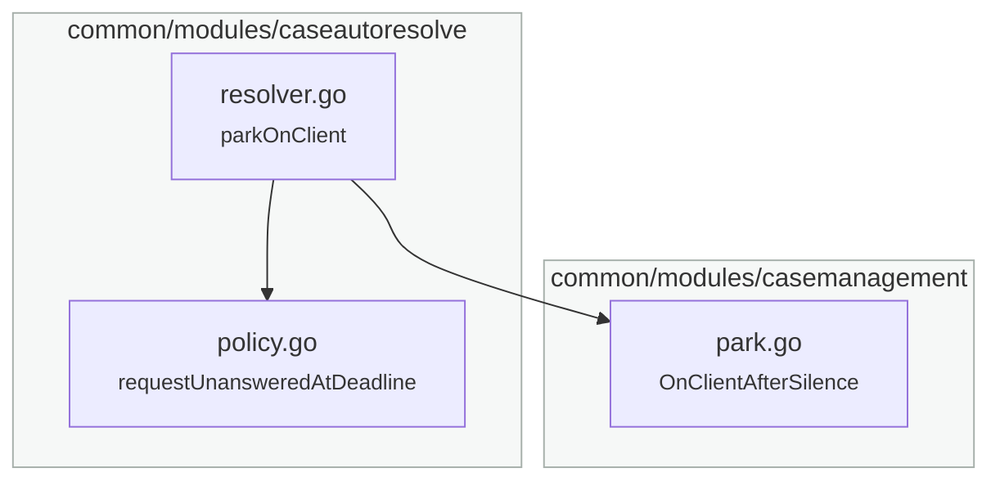

{{variant:frontmatter}}

Open a pull request, or rewrite the description of one that exists, so that a reader who never saw the branch can follow it: $ARGUMENTS

A description that lists what changed leaves the reader to rebuild the flow from the diff. They must hold the trigger, the path, the rules and the outcome in their head at once, and nothing on the page holds it for them. This method writes that model down first, and lists the changes after it.

Three artifacts carry the model. Produce all three every time, in this order:

1. **The flow**, as a Mermaid diagram — the path through the system that this change lives in, with the parts the change adds or moves marked.
2. **The outcomes**, as a table — one row for each case a person can observe, with what happened before and what happens now.
3. **The map**, as a Mermaid diagram — the changed production files, grouped by package, with an arrow from each file to the files it uses.

Then the change list, the notes a reviewer needs, and the links.

---

## Inputs

Read `$ARGUMENTS`:

- **nothing** — use the current branch. Update its pull request if one is open, otherwise create one.
- **a PR reference** — a number, `#N`, `owner/repo#N` or a URL. Update that pull request.
- `--dry-run` — write the description to the scratchpad and print it. Post nothing.
- `--no-diagram` — skip artifact 1, the flow; the map in artifact 3 stays. Use it for a change with no flow to draw, such as a rename across one package.

`gh` must be authenticated. `python3` renders nothing here, but it writes the JSON body for the API call, because a description with backticks and newlines does not survive a shell argument.

## 1. Read the branch before you write a word

```
git fetch origin
git log --oneline origin/<base>..HEAD
git log origin/<base>..HEAD --format=%B     # the full bodies, not the subjects
git diff --shortstat origin/<base>...HEAD
git diff --shortstat origin/<base>...HEAD -- ':!*_test.go' ':!*_test.py' ':!*.test.ts'
git diff origin/<base>...HEAD
```

Read the whole diff. Two numbers go in the description later: the size of the production change and the size of the whole change. A reader who sees "23 files" behaves differently from one who sees "14 production files, 182 lines added".

Take the ticket from the commit trailers, never from memory. Check every pull request number you plan to cite with `gh pr view <n> --json number,title,state`; a wrong number in a description sends the next reader to the wrong change.

## 2. Build the model

Answer these four questions from the diff, in writing, before drafting:

- **What starts the flow?** An event, a schedule, a request, a person.
- **What are the steps between the start and the outcome?** Name each one as the code names it.
- **Where does this change alter a step, add a branch, or change an outcome?**
- **What does a person see that differs?** The customer, the agent, the operator, the caller.

If you cannot answer the fourth question for a change, that change is a refactor. Say so in the description rather than inventing an outcome for it.

## 3. Artifact 1 — the flow

Draw the path, not the package structure; the files and their packages belong in artifact 3. A class diagram of the code answers a question nobody asked.

Rules that keep it readable:

- One diagram. If the change spans two flows that never meet, draw the larger one and say in a line that the other is untouched.
- Name the nodes as the system names them: the event type, the handler, the command. A reader greps the name.
- Mark what the change adds. Put `NEW` on that node's label or on the edge, and say nothing else in the label.
- Put the condition on the edge, not in a node. "the request went out AND nobody answered" belongs on the arrow into the close.
- Show the outcome a person cares about as its own node, such as "every account of the customer closes".
- Stop at ten to fifteen nodes. Past that, split the outcomes into the table instead.

**When the change is to an event, borrow the event grammar.** Four cases need a symbol this chain does not have:

- A new event type that nothing consumes yet.
- A new subscriber on an event that already has one.
- An event renamed or removed.
- An emission that the change takes away.

Each one asks the reader who else reacts, and one path hides the answer. Take the orange pills, the bare gears and the dashed red box for an absent emission from `~/.config/ai/method/draw-event-flow/templates/event-flow.mmd`. Keep the rules above, and keep it to one diagram. GitHub has no Font Awesome, so write the gear as `⚙` and never as `fa:fa-cog`. A change to a command is a path, so draw it in this grammar.

Write it to the scratchpad and **render it before it goes anywhere**:

```
mise exec -- mmdc -i <file>.mmd -o <file>.svg    # or: npx -y @mermaid-js/mermaid-cli -i ... -o ...
```

A diagram that does not parse renders on GitHub as a code block, which is worse than no diagram. Open the SVG once and look at it. Check that the changed parts stand out and that no label runs off its node. Then keep the source, not the picture: GitHub renders a fenced `mermaid` block in the description itself.

Two syntax traps in this repo's experience: `call` is a reserved word in Mermaid, and a `:::class` suffix ends the statement, so anything after it on the line is dropped. Quote every label that holds a comma or a slash.

## 4. Artifact 2 — the outcomes table

One row for each case a person can observe. Not one row per commit, and not one row per file.

| The case | Before | After |
|---|---|---|
| the situation, in the reader's words | what happened | what happens now |

Rules:

- A row says what a person experiences. "The case stayed open with no trigger that could close it" is a row. "Adds a `customerReplied` condition" is not.
- Cover the cases the change does **not** alter as well, where a reader would expect it to. A row that reads "unchanged" answers a question they would otherwise ask in review.
- Put the irreversible outcomes in their own sentence under the table. A reader must not have to infer that a close deactivates a customer.

## 5. Artifact 3 — the map

Draw the changed production files and the calls between them. A reviewer learns where each part of the change lives, and the arrows give the order to read it. A table of reviewer questions against files is the obvious alternative, but it names only the files someone thought to ask about, and its rows carry no order.



Rules:

- One `subgraph` for each package, labelled with the package path, so the node label holds only the file name.
- One node for every changed production file, and for no other file. A test file, or a file the change leaves alone, gets no node; the lines under the diagram carry the ones a reviewer needs.
- Under the file name, put the symbol that the change adds or changes in that file. The symbol is what the reviewer greps for.
- Draw an arrow from each file to every other changed file it calls or uses: a call, a field, a constructor argument, a type. Read the files on the branch, not only the hunks; an arrow the change did not add still shows the reader the structure.
- Where two files use each other, as files in one package often do, draw one arrow with two heads, `a <--> b`, not two arrows.
- Mark a new file with `NEW`, as in artifact 1.
- Give each subgraph the neutral `style` line from the example. Mermaid's default yellow fill pulls the eye to the packages instead of the files.
- Past fifteen files, draw one node for each package instead, and name its changed files in the node.
- When the production change is one or two files, skip the diagram and write the lines below alone.

Render it the way step 3 renders the flow, and look at it. Look hardest for an arrow that runs behind a node on its way to a node in the same row: the reader takes it for an arrow from the node it passes. Add an invisible link from the node it passes to its target, `<passed> ~~~ <target>`, which puts the target one row lower, and render again. Mermaid puts each file one row below the files that call it, and the order of the source lines does not change that. So the wiring usually lands on the top row and the rules a row or two down. Name the file to start at in one sentence under the diagram.

Under that sentence, write one line for each answer that an arrow cannot show:

- An unchanged file that reacts to an event the change writes, such as the handler that opens a ticket on `CustomerCaseParked`.
- The test files, each with the names of the scenarios that state the new behaviour.

End the section with the two sizes from step 1.

## 6. Write the description

Sections, in this order:

1. `## Summary` — two short paragraphs. What this change is part of, and what it finishes. Name the earlier pull requests if this is one of several.
2. `## The flow` — artifact 1, with one sentence above it that says what the diagram shows.
3. `## What changes for a person` — artifact 2.
4. `## Where the change lives` — artifact 3, with the file to start at and the lines under the diagram.
5. `## What changed` — one bullet for each commit, in commit order, each stating the rule rather than the edit.
6. `## Notes for the reviewer` — the decisions a reader cannot see in the diff: what the change leaves open on purpose, what an earlier review already settled, what the tests state about a behaviour that looks wrong at first read. Say that the suite passes, and say where it ran.
7. `## Links` — the ticket, the initiative trailer, the related pull requests.

**Write every word of the prose in Simplified Technical English**, following `~/.config/ai/guidelines/writing/asd-ste100.md`. Read that file before drafting; do not write it from memory. What it asks for, in short: one meaning per sentence, the plain word, the active voice, simple tenses, no `-ing` forms, no contractions, no metaphors, and `must` or `can` in place of `should` or `may`. Identifiers, event names, file paths and quoted text stay exactly as the code writes them.

Two habits that break it in a pull request: "this allows the resolver to…" (write "the resolver now…"), and "we've updated X to handle Y" (write "X now handles Y").

## 7. Post it, then read it back

### Create, when no pull request is open

Work out three things first, and say each of them in chat before you post:

- **The base.** `gh repo view --json defaultBranchRef --jq .defaultBranchRef.name`, unless the branch tracks another branch on purpose, such as a slice stacked on an earlier one. A stacked branch takes the branch below it as its base, never the default branch.
- **The title.** The ticket from the commit trailers, in the form the repository already uses — read `gh pr list --state merged --limit 10 --json title` and follow it. After the ticket, write what the change does for a person, not the module it touches.
- **Whether the branch is on the remote.** `git rev-parse --abbrev-ref --symbolic-full-name @{u}` fails when it is not.

An unpushed branch stops this method. Pushing writes to a place other people read, so ask for the word first, then `git push -u origin <branch>`. Where the user already asked for the pull request in the same breath, that is the word, and you push without asking again.

```
gh pr create --base <base> --head <branch> --title "[TICKET] <title>" --body-file <file>
```

Add `--draft` when the user says the work is not ready, or when the branch is stacked on a branch that is itself unmerged. Say which you did.

### Update, when one is open


Patch through the API rather than `gh pr edit`, which has failed silently here:

```
python3 -c "import json;json.dump({'body': open('<file>').read()}, open('<patch>.json','w'))"
gh api -X PATCH repos/<owner>/<repo>/pulls/<n> --input <patch>.json --jq .number
gh pr view <n> --json body --jq .body | head -20
```

Read the body back and check three things: both Mermaid blocks survived, the tables did not lose a column, and every pull request number is the one you checked in step 1.

Then print in chat: the pull request URL, the one-sentence summary, and any claim in the description you could not verify from the diff. Say which of the three artifacts you left out and why, if you left any out.

## What this method refuses to do

- **Invent a ticket, a number or a consequence.** Every sentence traces to the diff, a commit body, or the ticket. Where you are unsure, ask the user rather than writing a plausible sentence.
- **Push on its own.** The branch reaches other people when it is pushed, so that needs the user's word, once.
- **Describe a change the branch does not make.** Re-read the diff for each claim in the "before" column of the table; the "before" is the part authors get wrong most often, because they remember the intent rather than the code.
- **Replace a human review.** This writes the description. It runs no lenses and raises no findings; `/pr-digest` and `/code-review` do that.
